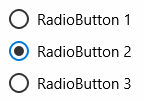

<!-- Class syntax.
public class RadioButton : Windows.UI.Xaml.Controls.Primitives.ToggleButton, Windows.UI.Xaml.Controls.IRadioButton
-->

# Windows.UI.Xaml.Controls.RadioButton

## -description
Represents a button that allows a user to select a single option from a group of options.

## -xaml-syntax
```xaml
<RadioButton .../>
-or-
<RadioButton ...>
  content
</RadioButton>
-or-
<RadioButton ...>stringContent</RadioButton>
```

## -remarks

> [!TIP]
> For more info, design guidance, and code examples, see [Radio buttons](/windows/uwp/design/controls-and-patterns/radio-button).

Use RadioButton controls to limit a user's selection to a single choice within a set of related, but mutually exclusive, choices. You group RadioButton controls by putting them inside the same parent container or by setting the [GroupName](radiobutton_groupname.md) property on each RadioButton to the same value.



A RadioButton has two states: selected or cleared. When a RadioButton is selected, its [IsChecked](../windows.ui.xaml.controls.primitives/togglebutton_ischecked.md) property is **true**. When a RadioButton is cleared, its [IsChecked](../windows.ui.xaml.controls.primitives/togglebutton_ischecked.md) property is **false**. A RadioButton can be cleared by clicking another RadioButton in the same group, but it cannot be cleared by clicking it again. However, a RadioButton can be cleared programmatically by setting its [IsChecked](../windows.ui.xaml.controls.primitives/togglebutton_ischecked.md) property to **false**.

### Control style and template

You can modify the default [Style](../windows.ui.xaml/style.md) and [ControlTemplate](controltemplate.md) to give the control a unique appearance. For information about modifying a control's style and template, see [Styling controls](https://docs.microsoft.com/windows/uwp/controls-and-patterns/styling-controls). The default style, template, and resources that define the look of the control are included in the generic.xaml file. For design purposes, generic.xaml is available in the \(Program Files)\Windows Kits\10\DesignTime\CommonConfiguration\Neutral\UAP\ &lt;SDK version&gt;\Generic folder from a Windows Software Development Kit (SDK) installation. Styles and resources from different versions of the SDK might have different values.

Starting in Windows 10, version 1607 (SDK 14393), generic.xaml includes resources that you can use to modify the colors of a control in different visual states without modifying the control template. In apps that target this software development kit (SDK) or later, modifying these resources is preferred to setting properties such as [Background](control_background.md) and [Foreground](control_foreground.md). For more info, see the [Light-weight styling](https://docs.microsoft.com/windows/uwp/controls-and-patterns/styling-controls) section of the [Styling controls](https://docs.microsoft.com/windows/uwp/controls-and-patterns/styling-controls) article.

This table shows the resources used by the RadioButton control.

<table>
   <tr><th>Resource key</th><th>Description</th></tr>
   <tr><td>RadioButtonBackground</td><td>Background color of entire control bounds at rest</td></tr>
   <tr><td>RadioButtonBackgroundPointerOver</td><td>Background color on hover</td></tr>
   <tr><td>RadioButtonBackgroundPressed</td><td>Background color when pressed</td></tr>
   <tr><td>RadioButtonBackgroundDisabled</td><td>Background color when disabled</td></tr>
   <tr><td>RadioButtonForeground</td><td>Label color at rest</td></tr>
   <tr><td>RadioButtonForegroundPointerOver</td><td>Label color on hover</td></tr>
   <tr><td>RadioButtonForegroundPressed</td><td>Label color when pressed</td></tr>
   <tr><td>RadioButtonForegroundDisabled</td><td>Label color when disabled</td></tr>
   <tr><td>RadioButtonBorderBrush</td><td>Border color of entire control bounds at rest</td></tr>
   <tr><td>RadioButtonBorderBrushPointerOver</td><td>Border color on hover</td></tr>
   <tr><td>RadioButtonBorderBrushPressed</td><td>Border color when pressed</td></tr>
   <tr><td>RadioButtonBorderBrushDisabled</td><td>Border color when disabled</td></tr>
   <tr><td>RadioButtonOuterEllipseStroke</td><td>Border color of unselected circular button</td></tr>
   <tr><td>RadioButtonOuterEllipseStrokePointerOver</td><td>Border color of unselected circular button on hover</td></tr>
   <tr><td>RadioButtonOuterEllipseStrokePressed</td><td>Border color of unselected circular button when pressed</td></tr>
   <tr><td>RadioButtonOuterEllipseStrokeDisabled</td><td>Border color of unselected circular button when disabled</td></tr>
   <tr><td>RadioButtonOuterEllipseFill</td><td>Background color of unselected circular button</td></tr>
   <tr><td>RadioButtonOuterEllipseFillPointerOver</td><td>Background color of unselected circular button on hover</td></tr>
   <tr><td>RadioButtonOuterEllipseFillPressed</td><td>Background color of unselected circular button when pressed</td></tr>
   <tr><td>RadioButtonOuterEllipseFillDisabled</td><td>Background color of unselected circular button when disabled</td></tr>
   <tr><td>RadioButtonOuterEllipseCheckedStroke</td><td>Border color of selected circular button</td></tr>
   <tr><td>RadioButtonOuterEllipseCheckedStrokePointerOver</td><td>Border color of selected circular button on hover</td></tr>
   <tr><td>RadioButtonOuterEllipseCheckedStrokePressed</td><td>Border color of selected circular button when pressed</td></tr>
   <tr><td>RadioButtonOuterEllipseCheckedStrokeDisabled</td><td>Border color of selected circular button when disabled</td></tr>
   <tr><td>RadioButtonOuterEllipseCheckedFill</td><td>Background color of selected circular button</td></tr>
   <tr><td>RadioButtonOuterEllipseCheckedFillPointerOver</td><td>Background color selected circular button on hover</td></tr>
   <tr><td>RadioButtonOuterEllipseCheckedFillPressed</td><td>Background color selected circular button when pressed</td></tr>
   <tr><td>RadioButtonOuterEllipseCheckedFillDisabled</td><td>Background color selected circular button when disabled</td></tr>
   <tr><td>RadioButtonCheckGlyphStroke</td><td>Border color of the selected button's 'dot'</td></tr>
   <tr><td>RadioButtonCheckGlyphStrokePointerOver</td><td>Border color of the selected button's 'dot' on hover</td></tr>
   <tr><td>RadioButtonCheckGlyphStrokePressed</td><td>Border color of the selected button's 'dot' when pressed</td></tr>
   <tr><td>RadioButtonCheckGlyphStrokeDisabled</td><td>Border color of the selected button's 'dot' when disabled</td></tr>
   <tr><td>RadioButtonCheckGlyphFill</td><td>Color of the selected button's 'dot'</td></tr>
   <tr><td>RadioButtonCheckGlyphFillPointerOver</td><td>Color of the selected button's 'dot' on hover</td></tr>
   <tr><td>RadioButtonCheckGlyphFillPressed</td><td>Color of the selected button's 'dot' when pressed</td></tr>
   <tr><td>RadioButtonCheckGlyphFillDisabled</td><td>Color of the selected button's 'dot' when disabled</td></tr>
</table>

## -examples

> [!TIP]
> For more info, design guidance, and code examples, see [Radio buttons](/windows/uwp/design/controls-and-patterns/radio-button).
>
> If you have the **XAML Controls Gallery** app installed, click here to [open the app and see the RadioButton in action](xamlcontrolsgallery:/item/RadioButton).
> + [Get the XAML Controls Gallery app (Microsoft Store)](https://www.microsoft.com/store/productId/9MSVH128X2ZT)
> + [Get the source code (GitHub)](https://github.com/Microsoft/Xaml-Controls-Gallery)

The following example shows three radio buttons. The first two radio buttons are grouped together. The remaining radio button is not grouped explicitly, which means that you can select the third radio button and either the first or second. When you select a radio button, a [TextBlock](textblock.md) displays the name of the group, if the radio button has an explicit group name, and the name of the radio button.

[!code-xml[1](../windows.ui.xaml.data/code/System.Windows.Controls.RadioButtonEx/csharp/Page.xaml#Snippet1)]

[!code-csharp[11](../windows.ui.xaml.data/code/System.Windows.Controls.RadioButtonEx/csharp/Page.xaml.cs#Snippet11)]

[!code-vb[11](../windows.ui.xaml.data/code/System.Windows.Controls.RadioButtonEx/vbnet/Page.xaml.vb#Snippet11)]

## -see-also
[Radio buttons overview](https://docs.microsoft.com/windows/uwp/controls-and-patterns/radio-button), [ToggleButton](../windows.ui.xaml.controls.primitives/togglebutton.md), [CheckBox](checkbox.md), [ToggleSwitch](toggleswitch.md), [Controls list](https://docs.microsoft.com/windows/uwp/design/controls-and-patterns/), [Controls by function](https://docs.microsoft.com/windows/uwp/controls-and-patterns/controls-by-function)
p://msdn.microsoft.com/library/8db4347b-91d6-4659-91f2-80ecf7bbb596)
