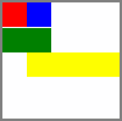

<!-- Class syntax.
public class RelativePanel : Windows.UI.Xaml.Controls.Panel, Windows.UI.Xaml.Controls.IRelativePanel
-->

# Windows.UI.Xaml.Controls.RelativePanel

## -description
Defines an area within which you can position and align child objects in relation to each other or the parent panel.


## -xaml-syntax
```xaml
<RelativePanel ...>
  oneOrMoreUIElements
</RelativePanel>
-or-
<RelativePanel .../>
```


## -remarks

RelativePanel is a layout container that is useful for creating UI that do not have a clear linear pattern; that is, layouts that are not fundamentally stacked, wrapped, or tabular, where you might naturally use a [StackPanel](stackpanel.md) or [Grid](grid.md).

If your UI consists of multiple nested panels, RelativePanel is a good option to consider.

Here's an example of a UI using a RelativePanel for its layout:



```xaml
<RelativePanel BorderBrush="Gray" BorderThickness="10">
    <Rectangle x:Name="RedRect" Fill="Red" MinHeight="100" MinWidth="100"/>
    <Rectangle x:Name="BlueRect" Fill="Blue" MinHeight="100" MinWidth="100" 
               RelativePanel.RightOf="RedRect"/>
    <!-- Width is not set on the green and yellow rectangles.
         It's determined by the RelativePanel properties. -->
    <Rectangle x:Name="GreenRect" Fill="Green" MinHeight="100" Margin="0,5,0,0" 
               RelativePanel.Below="RedRect" 
               RelativePanel.AlignLeftWith="RedRect" 
               RelativePanel.AlignRightWith="BlueRect"/>
    <Rectangle Fill="Yellow" MinHeight="100" 
               RelativePanel.Below="GreenRect" 
               RelativePanel.AlignLeftWith="BlueRect" 
               RelativePanel.AlignRightWithPanel="True"/>
</RelativePanel>
```

RelativePanel, used in conjunction with [AdaptiveTrigger](../windows.ui.xaml/adaptivetrigger.md) s, can be a powerful tool to create responsive UI that scales well across different screen sizes. For more examples, see the [XAML Responsive Techniques sample](https://github.com/Microsoft/Windows-universal-samples/tree/master/Samples/XamlResponsiveTechniques?amp;amp;clcid=0x409).

### Default position

By default, any unconstrained element declared as a child of the RelativePanel is given the entire available space and positioned at the (0, 0) coordinates (upper left corner) of the panel. So, if you are positioning a second element relative to an unconstrained element, keep in mind that the second element might get pushed out of the panel.

In this example, `RectA` doesn't have any constraints, so it's positioned at (0,0). `RectB` is not shown on the screen because it is declared to be [Above](/uwp/api/windows.ui.xaml.controls.relativepanel.above)  `RectA` and is therefore pushed out of the panel.

```xaml
<RelativePanel>
    <Rectangle Name="RectA" Fill="Red" Height="40" Width="40"/>
    <Rectangle Name="RectB" Fill="Blue" Height="40" Width="40"
               RelativePanel.Above="RectA"/>
</RelativePanel>
```

### Circular dependency

A circular dependency occurs when two elements inside a RelativePanel declare relationships with each other in any direction. For example, this XAML results in a design-time exception, "RelativePanel error: Circular dependency detected. Layout could not complete."

```xaml
<RelativePanel>
    <Rectangle Name="RectA" Fill="Red" Height="40" Width="40"
               RelativePanel.Above="RectB"/>
    <Rectangle Name="RectB" Fill="Blue" Height="40" Width="40"
               RelativePanel.Below="RectA"/>
</RelativePanel>
```

### Conflicting relationships

If you set multiple relationships that target the same edge of an element, you might have conflicting relationships in your layout as a result. When this happens, the relationships are applied in the following order of priority:
+ Panel alignment relationships ([AlignTopWithPanel](/uwp/api/windows.ui.xaml.controls.relativepanel.aligntopwithpanel), [AlignLeftWithPanel](/uwp/api/windows.ui.xaml.controls.relativepanel.alignleftwithpanel), …) are applied first.
+ Sibling alignment relationships ([AlignTopWith](/uwp/api/windows.ui.xaml.controls.relativepanel.aligntopwith), [AlignLeftWith](/uwp/api/windows.ui.xaml.controls.relativepanel.alignleftwith), …) are applied second.
+ Sibling positional relationships ([Above](/uwp/api/windows.ui.xaml.controls.relativepanel.above), [Below](/uwp/api/windows.ui.xaml.controls.relativepanel.below), [RightOf](/uwp/api/windows.ui.xaml.controls.relativepanel.rightof), [LeftOf](/uwp/api/windows.ui.xaml.controls.relativepanel.leftof)) are applied last.

The panel-center alignment properties ([AlignVerticalCenterWith](/uwp/api/windows.ui.xaml.controls.relativepanel.alignverticalcenterwith), [AlignHorizontalCenterWithPanel](/uwp/api/windows.ui.xaml.controls.relativepanel.alignhorizontalcenterwithpanel), ...) are typically used independently of other constraints and are applied if there is no conflict.

The [HorizontalAlignment](../windows.ui.xaml/frameworkelement_horizontalalignment.md) and [VerticalAlignment](../windows.ui.xaml/frameworkelement_verticalalignment.md) properties on UI elements are applied after relationship properties are evaluated and applied. These properties control the placement of the element within the available size for the element, if the desired size is smaller than the available size.

### Border properties

RelativePanel defines border properties that let you draw a border around the RelativePanel without using an additional [Border](border.md) element. The properties are [RelativePanel.BorderBrush](relativepanel_borderbrush.md), [RelativePanel.BorderThickness](relativepanel_borderthickness.md), [RelativePanel.CornerRadius](relativepanel_cornerradius.md), and [RelativePanel.Padding](relativepanel_padding.md).

```xaml
<RelativePanel BorderBrush="Red" BorderThickness="2" CornerRadius="10" Padding="12">
    <TextBox x:Name="textBox1" RelativePanel.AlignLeftWithPanel="True"/>
    <Button Content="Submit" RelativePanel.Below="textBox1"/>
</RelativePanel>
```

### XAML attached properties

RelativePanel is the host service class for several [XAML attached properties](/windows/uwp/xaml-platform/attached-properties-overview).

In order to support XAML processor access to the attached properties, and also to expose equivalent _get_ and _set_ operations to code, each XAML attached property has a pair of Get and Set accessor methods. Another way to get or set the value in code is to use the dependency property system, calling either [GetValue](../windows.ui.xaml/dependencyobject_getvalue_1188551207.md) or [SetValue](../windows.ui.xaml/dependencyobject_setvalue_52578133.md) and passing the identifier field as the dependency property identifier.

| Attached property | Description |
| - | - |
| [Above](relativepanel_above.md) | Gets or sets a target element that this element is positioned above. |
| [AlignBottomWith](relativepanel_alignbottomwith.md) | Gets or sets a target element that this element's bottom edge is aligned with. |
| [AlignBottomWithPanel](relativepanel_alignbottomwithpanel.md) | Gets or sets a value that indicates whether this element's bottom edge is touching the panel's bottom edge. |
| [AlignHorizontalCenterWith](relativepanel_alignhorizontalcenterwith.md) | Gets or sets a target element that this element's horizontal center is aligned with. |
| [AlignHorizontalCenterWithPanel](relativepanel_alignhorizontalcenterwithpanel.md) | Gets or sets a value that indicates whether this element's horizontal axis is touching the panel's horizontal axis. |
| [AlignLeftWith](relativepanel_alignleftwith.md) | Gets or sets a target element that this element's left edge is aligned with. |
| [AlignLeftWithPanel](relativepanel_alignleftwithpanel.md) | Gets or sets a value that indicates whether this element's left edge is touching the panel's left edge. |
| [AlignRightWith](relativepanel_alignrightwith.md) | Gets or sets a target element that this element's right edge is aligned with. |
| [AlignRightWithPanel](relativepanel_alignrightwithpanel.md) | Gets or sets a value that indicates whether this element's right edge is touching the panel's right edge. |
| [AlignTopWith](relativepanel_aligntopwith.md) | Gets or sets a target element that this element's top edge is aligned with. |
| [AlignTopWithPanel](relativepanel_aligntopwithpanel.md) | Gets or sets a value that indicates whether this element's top edge is touching the panel's top edge. |
| [AlignVerticalCenterWith](relativepanel_alignverticalcenterwith.md) | Gets or sets a target element that this element's vertical center is aligned with. |
| [AlignVerticalCenterWithPanel](relativepanel_alignverticalcenterwithpanel.md) | Gets or sets a value that indicates whether this element's vertical axis is touching the panel's horizontal axis. |
| [Below](relativepanel_below.md) | Gets or sets a target element that this element is positioned below. |
| [LeftOf](relativepanel_leftof.md) | Gets or sets a target element that this element is positioned to the left of. |
| [RightOf](relativepanel_rightof.md) | Gets or sets a target element that this element is positioned to the right of. |

### Version history

| Windows version | SDK version | Value added |
| -- | -- | -- |
| 1809 | 17763 | BackgroundSizing |

## -examples

> [!TIP]
> For more info, design guidance, and code examples, see [Layout panels](/windows/uwp/design/layout/layout-panels#relativepanel).
>
> If you have the **WinUI 2 Gallery** app installed, click here to [open the app and see the RelativePanel in action](winui2gallery:/item/RelativePanel).
> + [Get the WinUI 2 Gallery app (Microsoft Store)](https://www.microsoft.com/store/productId/9MSVH128X2ZT)
> + [Get the source code (GitHub)](https://github.com/Microsoft/WinUI-Gallery)

## -see-also
[Panel](panel.md), [Define layouts with XAML](/windows/uwp/layout/layouts-with-xaml), [Quickstart: Adding layout controls](/previous-versions/windows/apps/hh969155(v=win.10)), [Alignment, margin, and padding](/windows/uwp/layout/alignment-margin-padding), [Canvas](canvas.md), [Grid](grid.md), [StackPanel](stackpanel.md), [VariableSizedWrapGrid](variablesizedwrapgrid.md), [Controls list](/windows/uwp/design/controls-and-patterns/), [Controls by function](/windows/uwp/controls-and-patterns/controls-by-function)
