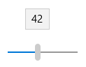

<!-- Class syntax.
public class Slider : Windows.UI.Xaml.Controls.Primitives.RangeBase, Windows.UI.Xaml.Controls.ISlider, Windows.UI.Xaml.Controls.ISlider2
-->

# Windows.UI.Xaml.Controls.Slider

## -description
Represents a control that lets the user select from a range of values by moving a [Thumb](../windows.ui.xaml.controls.primitives/thumb.md) control along a track.


## -xaml-syntax
```xaml
<Slider .../>
```


## -remarks

> [!TIP]
> For more info, design guidance, and code examples, see [Sliders](/windows/uwp/design/controls-and-patterns/slider).

Slider is a control that lets the user select from a range of values by moving a [Thumb](../windows.ui.xaml.controls.primitives/thumb.md) control along a track.



Use a Slider control when you want your users to be able to set defined, contiguous values (such as volume or brightness) or a range of discrete values (such as screen resolution settings). Sliders are for user interaction. If a user can't ever change the value, use read-only text instead. For more information on when to use a Slider, see [Guidelines for sliders](/windows/uwp/controls-and-patterns/slider).

### Binding Minimum and Maximum values

When binding [Minimum](../windows.ui.xaml.controls.primitives/rangebase_minimum.md) and [Maximum](../windows.ui.xaml.controls.primitives/rangebase_maximum.md) values in Extensible Application Markup Language (XAML), declare the [Binding](../windows.ui.xaml.data/binding.md) for [Maximum](../windows.ui.xaml.controls.primitives/rangebase_maximum.md) first. If the [Binding](../windows.ui.xaml.data/binding.md) for [Maximum](../windows.ui.xaml.controls.primitives/rangebase_maximum.md) is declared after [Minimum](../windows.ui.xaml.controls.primitives/rangebase_minimum.md), the bound value for [Maximum](../windows.ui.xaml.controls.primitives/rangebase_maximum.md) is ignored and the following situations can occur: 

+ If the bound [Minimum](../windows.ui.xaml.controls.primitives/rangebase_minimum.md) value is negative, the [Maximum](../windows.ui.xaml.controls.primitives/rangebase_maximum.md) value is set to 0.
+ If the bound [Minimum](../windows.ui.xaml.controls.primitives/rangebase_minimum.md) value is greater than the default [Maximum](../windows.ui.xaml.controls.primitives/rangebase_maximum.md) (100 for Slider and [ProgressBar](progressbar.md)), the [Maximum](../windows.ui.xaml.controls.primitives/rangebase_maximum.md) value is set equal to the [Minimum](../windows.ui.xaml.controls.primitives/rangebase_minimum.md) value.

To avoid this behavior, declare the [Binding](../windows.ui.xaml.data/binding.md) for [Maximum](../windows.ui.xaml.controls.primitives/rangebase_maximum.md) first in your Extensible Application Markup Language (XAML).

These behaviors can also occur if you set the [Minimum](../windows.ui.xaml.controls.primitives/rangebase_minimum.md) value without also explicitly setting the [Maximum](../windows.ui.xaml.controls.primitives/rangebase_maximum.md) value.

### Control style and template

You can modify the default [Style](../windows.ui.xaml/style.md) and [ControlTemplate](controltemplate.md) to give the control a unique appearance. For information about modifying a control's style and template, see [Styling controls](/windows/uwp/controls-and-patterns/styling-controls). The default style, template, and resources that define the look of the control are included in the `generic.xaml` file. For design purposes, `generic.xaml` is available locally with the SDK or NuGet package installation.

- **[WinUI Styles (recommended)](/windows/apps/design/style/xaml-styles#winui-and-styles):** For updated styles from WinUI, see `\Users\<username>\.nuget\packages\microsoft.ui.xaml\<version>\lib\uap10.0\Microsoft.UI.Xaml\Themes\generic.xaml`.
- **Non-WinUI styles:** For built-in styles, see `%ProgramFiles(x86)%\Windows Kits\10\DesignTime\CommonConfiguration\Neutral\UAP\<SDK version>\Generic\generic.xaml`.

Locations might be different if you customized the installation. Styles and resources from different versions of the SDK might have different values.

XAML also includes resources that you can use to modify the colors of a control in different visual states without modifying the control template. Modifying these resources is preferred to setting properties such as [Background](control_background.md) and [Foreground](control_foreground.md). For more info, see the [Light-weight styling](/windows/apps/design/style/xaml-styles#lightweight-styling) section of the [XAML styles](/windows/apps/design/style/xaml-styles) article. Light-weight styling resources are available starting in Windows 10, version 1607 (SDK 14393).

## -examples

> [!TIP]
> For more info, design guidance, and code examples, see [Slider](/windows/apps/design/controls/slider).

> [!div class="nextstepaction"]
> [Open the WinUI 2 Gallery app and see the Slider in action](winui2gallery:/item/Slider)

> The **WinUI 2 Gallery** app includes interactive examples of most WinUI 2 controls, features, and functionality. Get the app from the [Microsoft Store](https://www.microsoft.com/store/productId/9MSVH128X2ZT) or get the source code on [GitHub](https://github.com/Microsoft/WinUI-Gallery/tree/winui2).

The following code example shows several slider controls and how to handle the [ValueChanged](../windows.ui.xaml.controls.primitives/rangebase_valuechanged.md) event. The [ValueChanged](../windows.ui.xaml.controls.primitives/rangebase_valuechanged.md) event is used to update the value of a [TextBlock](textblock.md) as the [Value](../windows.ui.xaml.controls.primitives/rangebase_value.md) property of the slider changes.


[!code-xaml[1](../windows.ui.xaml.data/code/System.Windows.Controls.Extended.SliderSL/csharp/Page.xaml#Snippet1)]

[!code-csharp[11](../windows.ui.xaml.data/code/System.Windows.Controls.Extended.SliderSL/csharp/Page.xaml.cs#Snippet11)]

[!code-vb[11](../windows.ui.xaml.data/code/System.Windows.Controls.Extended.SliderSL/vbnet/Page.xaml.vb#Snippet11)]

## -see-also
[Sliders overview](/windows/uwp/controls-and-patterns/slider), [RangeBase](../windows.ui.xaml.controls.primitives/rangebase.md), [ComboBox](combobox.md), [ListBox](listbox.md), [Controls list](/windows/uwp/design/controls-and-patterns/), [Controls by function](/windows/uwp/controls-and-patterns/controls-by-function)
