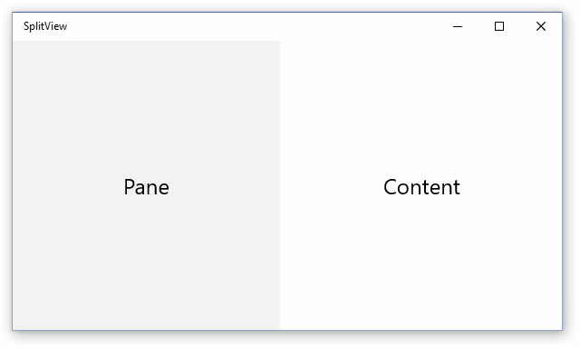

<!-- Class syntax.
public class SplitView : Windows.UI.Xaml.Controls.Control, Windows.UI.Xaml.Controls.ISplitView, Windows.UI.Xaml.Controls.ISplitView2
-->

# Windows.UI.Xaml.Controls.SplitView

## -description

Represents a container with two views; one view for the main content and another view that is typically used for navigation commands.


## -xaml-syntax

```xaml
<SplitView>
  <SplitView.Content>
    singleObject
  </SplitView.Content>
  <SplitView.Pane>
    singleObject
  </SplitView.Pane>
</SplitView>

```

## -remarks

> [!TIP]
> For more info, design guidance, and code examples, see [Split view](/windows/uwp/design/controls-and-patterns/split-view).

The SplitView control presents two areas of content: a [Pane](splitview_pane.md) and the main [Content](splitview_content.md). You typically use a SplitView to create a top-level navigation experience that adapts to different screen widths following the [nav pane pattern](/windows/uwp/controls-and-patterns/nav-pane) or the [master/details pattern](/windows/uwp/design/controls-and-patterns/master-details), but it's not strictly limited to use for navigation.

The XAML for this SplitView is shown in the Examples section.



The [Content](splitview_content.md) area is always present and can contain a single child element, which is typically a [Panel](panel.md) derived container that contains additional child elements. Although the [Content](splitview_content.md) is always present, it can be completely covered by the [Pane](splitview_pane.md).

There are several properties you can set to control the appearance and behavior of the [Pane](splitview_pane.md). Set the [IsPaneOpen](splitview_ispaneopen.md) property to open or close the [Pane](splitview_pane.md). The SplitView does not include a built-in affordance for users to toggle the state of the [Pane](splitview_pane.md), like a menu (or “hamburger”) button. You must provide this affordance and the code to toggle the [IsPaneOpen](splitview_ispaneopen.md) property.

To specify the length of the open pane, set the [OpenPaneLength](splitview_openpanelength.md) property. You can set the [PanePlacement](splitview_paneplacement.md) property to have the [Pane](splitview_pane.md) appear on either the left or right side of the [Content](splitview_content.md).

Although the appearance of the control is largely based on the elements assigned to the [Pane](splitview_pane.md) and [Content](splitview_content.md), you can change the default background color of the [Pane](splitview_pane.md) by setting the [PaneBackground](splitview_panebackground.md).

Set the [DisplayMode](splitview_displaymode.md) property to configure the interaction of the [Pane](splitview_pane.md) with the [Content](splitview_content.md). By default, the [Pane](splitview_pane.md) overlays the [Content](splitview_content.md) and disappears completely when closed. You can use one of the "inline" modes to show the [Pane](splitview_pane.md) side-by-side with the [Content](splitview_content.md). You can use the "compact" modes to make a narrow section of the [Pane](splitview_pane.md) remain visible even when the [Pane](splitview_pane.md) is closed. See the [SplitViewDisplayMode](splitviewdisplaymode.md) enumeration for more info about the supported modes.

### Version history

| Windows version | SDK version | Value added |
| -- | -- | -- |
| 1607 | 14393 | LightDismissOverlayMode |
| 1709 | 16299 | PaneOpened |
| 1709 | 16299 | PaneOpening |

## -examples

> [!TIP]
> For more info, design guidance, and code examples, see [Split view](/windows/uwp/design/controls-and-patterns/split-view).
>
> If you have the **WinUI 2 Gallery** app installed, click here to [open the app and see the SplitView in action](winui2gallery:/item/SplitView).
> + [Get the WinUI 2 Gallery app (Microsoft Store)](https://www.microsoft.com/store/productId/9MSVH128X2ZT)
> + [Get the source code (GitHub)](https://github.com/Microsoft/WinUI-Gallery)

Here's a SplitView control with an open [Pane](splitview_pane.md) appearing inline next to the [Content](splitview_content.md).

```xaml
<SplitView IsPaneOpen="True"
           DisplayMode="Inline"
           OpenPaneLength="296">
    <SplitView.Pane>
        <TextBlock Text="Pane"
                   FontSize="24"
                   VerticalAlignment="Center"
                   HorizontalAlignment="Center"/>
    </SplitView.Pane>

    <Grid>
        <TextBlock Text="Content"
                   FontSize="24"
                   VerticalAlignment="Center"
                   HorizontalAlignment="Center"/>
    </Grid>
</SplitView>
```

## -see-also

[Split view control overview](/windows/uwp/design/controls-and-patterns/split-view)
