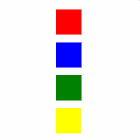

<!-- Class syntax.
public class StackPanel : Windows.UI.Xaml.Controls.Panel, Windows.UI.Xaml.Controls.IInsertionPanel, Windows.UI.Xaml.Controls.IStackPanel, Windows.UI.Xaml.Controls.IStackPanel2, Windows.UI.Xaml.Controls.Primitives.IScrollSnapPointsInfo
-->

# Windows.UI.Xaml.Controls.StackPanel

## -description
Arranges child elements into a single line that can be oriented horizontally or vertically.

## -xaml-syntax
```xaml
<StackPanel .../>
-or-
<StackPanel ...>
  oneOrMoreChildren
</StackPanel>

```


## -remarks
[StackPanel](stackpanel.md) is a layout panel that arranges child elements into a single line that can be oriented horizontally or vertically.



By default, [StackPanel](stackpanel.md) stacks items vertically from top to bottom in the order they are declared. You can set the [Orientation](stackpanel_orientation.md) property to **Horizontal** to stack items from left to right.

You can insert items into a [StackPanel](stackpanel.md) at a specific location using the [Insert](uielementcollection_insert.md) method in code-behind.

> [!TIP]
> Starting in Windows 10, [StackPanel](stackpanel.md) defines new border properties that let you draw a border around the [StackPanel](stackpanel.md) without using an additional [Border](border.md) element. The new properties are [StackPanel.BorderBrush](stackpanel_borderbrush.md), [StackPanel.BorderThickness](stackpanel_borderthickness.md), [StackPanel.CornerRadius](stackpanel_cornerradius.md), and [StackPanel.Padding](stackpanel_padding.md).


```xaml
<StackPanel BorderBrush="Red" BorderThickness="2" CornerRadius="10" Padding="12">
    <TextBlock Text="Hello World!"/>
</StackPanel>
```

## -examples

<table>
<th align="left">XAML Controls Gallery<th>
<tr>
<td></img></td>
<td>
    <p>If you have the <strong style="font-weight: semi-bold">XAML Controls Gallery</strong> app installed, click here to <a href="xamlcontrolsgallery:/item/StackPanel">open the app and see the StackPanel in action</a>.</p>
    <ul>
    <li><a href="https://www.microsoft.com/store/productId/9MSVH128X2ZT">Get the XAML Controls Gallery app (Microsoft Store)</a></li>
    <li><a href="https://github.com/Microsoft/Windows-universal-samples/tree/master/Samples/XamlUIBasics">Get the source code (GitHub)</a></li>
    </ul>
</td>
</tr>
</table>

The following example shows how to create a [StackPanel](stackpanel.md) of items.

[!code-xml[LayoutOvwStackPanel_1](../windows.ui.xaml/code/layout_ovw_all/CSharp/MainPage.xaml#SnippetLayoutOvwStackPanel_1)]

[!code-xml[02](../windows.ui.xaml.controls/code/StackPanel1/csharp/Page.xaml#Snippet02)]

[!code-csharp[01](../windows.ui.xaml.controls/code/StackPanel1/csharp/Page.xaml.cs#Snippet01)]

[!code-vb[01](../windows.ui.xaml.controls/code/StackPanel1/vbnet/Page.xaml.vb#Snippet01)]

## -see-also
[Panel](panel.md), [IScrollSnapPointsInfo](../windows.ui.xaml.controls.primitives/iscrollsnappointsinfo.md), [Define layouts](http://msdn.microsoft.com/library/8d4e4162-1c9c-48f4-8a94-34976fb17079), [Alignment, margin, and padding](http://msdn.microsoft.com/library/9412abd4-3674-4865-b07d-64c7c26e4842), [Canvas](canvas.md), [Grid](grid.md), [ItemsStackPanel](itemsstackpanel.md), [VariableSizedWrapGrid](variablesizedwrapgrid.md), [VirtualizingStackPanel](virtualizingstackpanel.md), [Controls list](http://msdn.microsoft.com/library/11172840-a63d-4f48-9db4-7baca06308ee), [Controls by function](http://msdn.microsoft.com/library/8db4347b-91d6-4659-91f2-80ecf7bbb596)
347b-91d6-4659-91f2-80ecf7bbb596)
