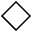
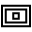

<!-- Enumeration syntax
public enum Windows.UI.Xaml.Controls.Symbol : int
-->

# Symbol

## -description
Defines constants that specify a glyph from the Segoe MDL2 Assets font to use as the content of a [SymbolIcon](symbolicon.md).

## -xaml-syntax
```xaml
<SymbolIcon Symbol="enumMemberName"/>
```


## -enum-fields
### -field Previous:57600
E100 

### -field Next:57601
E101 

### -field Play:57602
E102 

### -field Pause:57603
E103 

### -field Edit:57604
E104 

### -field Save:57605
E105 

### -field Clear:57606
E106 

### -field Delete:57607
E107 

### -field Remove:57608
E108 

### -field Add:57609
E109 

### -field Cancel:57610
E10A 

### -field Accept:57611
E10B 

### -field More:57612
E10C 

### -field Redo:57613
E10D 

### -field Undo:57614
E10E 

### -field Home:57615
E10F 

### -field Up:57616
E110 

### -field Forward:57617
E111 

### -field Back:57618
E112 

### -field Favorite:57619
E113 

### -field Camera:57620
E114 

### -field Setting:57621
E115 

### -field Video:57622
E116 

### -field Sync:57623
E117 

### -field Download:57624
E118 

### -field Mail:57625
E119 

### -field Find:57626
E11A 

### -field Help:57627
E11B 

### -field Upload:57628
E11C 

### -field Emoji:57629
E11D 

### -field TwoPage:57630
E11E 

### -field LeaveChat:57631
E11F 

### -field MailForward:57632
E120 

### -field Clock:57633
E121 

### -field Send:57634
E122 

### -field Crop:57635
E123 

### -field RotateCamera:57636
E124 

### -field People:57637
E125 

### -field OpenPane:57638
E126 

### -field ClosePane:57639
E127 

### -field World:57640
E128 

### -field Flag:57641
E129 

### -field PreviewLink:57642
E12A 

### -field Globe:57643
E12B 

### -field Trim:57644
E12C 

### -field AttachCamera:57645
E12D 

### -field ZoomIn:57646
E12E 

### -field Bookmarks:57647
E12F 

### -field Document:57648
E130 

### -field ProtectedDocument:57649
E131 

### -field Page:57650
E132 

### -field Bullets:57651
E133 

### -field Comment:57652
E134 

### -field MailFilled:57653
E135 

### -field ContactInfo:57654
E136 

### -field HangUp:57655
E137 

### -field ViewAll:57656
E138 

### -field MapPin:57657
E139 

### -field Phone:57658
E13A 

### -field VideoChat:57659
E138 

### -field Switch:57660
E13C 

### -field Contact:57661
E13D 

### -field Rename:57662
E13E 

### -field Pin:57665
E141 

### -field MusicInfo:57666
E142 

### -field Go:57667
E143 

### -field Keyboard:57668
E144 

### -field DockLeft:57669
E145 

### -field DockRight:57670
E146 

### -field DockBottom:57671
E147 

### -field Remote:57672
E148 

### -field Refresh:57673
E149 

### -field Rotate:57674
E14A 

### -field Shuffle:57675
E14B 

### -field List:57676
E14C 

### -field Shop:57677
E14D 

### -field SelectAll:57678
E14E 

### -field Orientation:57679
E14F 

### -field Import:57680
E150 

### -field ImportAll:57681
E151 

### -field BrowsePhotos:57685
E155 

### -field WebCam:57686
E156 

### -field Pictures:57688
E158 

### -field SaveLocal:57689
E159 

### -field Caption:57690
E15A 

### -field Stop:57691
E15B 

### -field ShowResults:57692
E15C 

### -field Volume:57693
E15D 

### -field Repair:57694
E15E 

### -field Message:57695
E15F 

### -field Page2:57696
E160 

### -field CalendarDay:57697
E161 

### -field CalendarWeek:57698
E162 

### -field Calendar:57699
E163 

### -field Character:57700
E164 

### -field MailReplyAll:57701
E165 

### -field Read:57702
E166 

### -field Link:57703
E167 

### -field Account:57704
E168 

### -field ShowBcc:57705
E169 

### -field HideBcc:57706
E16A 

### -field Cut:57707
E16B 

### -field Attach:57708
E16C 

### -field Paste:57709
E16D 

### -field Filter:57710
E16E 

### -field Copy:57711
E16F 

### -field Emoji2:57712
E170 

### -field Important:57713
E171 

### -field MailReply:57714
E172 

### -field SlideShow:57715
E173 

### -field Sort:57716
E174 

### -field Manage:57720
E178 

### -field AllApps:57721
E179 

### -field DisconnectDrive:57722
E17A 

### -field MapDrive:57723
E17B 

### -field NewWindow:57724
E17C 

### -field OpenWith:57725
E17D 

### -field ContactPresence:57729
E181 

### -field Priority:57730
E182 

### -field GoToToday:57732
E184 

### -field Font:57733
E185 

### -field FontColor:57734
E186 

### -field Contact2:57735
E187 

### -field Folder:57736
E188 

### -field Audio:57737
E189 

### -field Placeholder:57738
E18A 

### -field View:57739
E18B 

### -field SetLockScreen:57740
E18C 

### -field SetTile:57741
E18D 

### -field ClosedCaption:57744
E190 

### -field StopSlideShow:57745
E191 

### -field Permissions:57746
E192 

### -field Highlight:57747
E193 

### -field DisableUpdates:57748
E194 

### -field UnFavorite:57749
E195 

### -field UnPin:57750
E196 

### -field OpenLocal:57751
E197 

### -field Mute:57752
E198 

### -field Italic:57753
E199 

### -field Underline:57754
E19A 

### -field Bold:57755
E19B 

### -field MoveToFolder:57756
E19C 

### -field LikeDislike:57757
E19D 

### -field Dislike:57758
E19E 

### -field Like:57759
E19F 

### -field AlignRight:57760
E1A0 

### -field AlignCenter:57761
E1A1 

### -field AlignLeft:57762
E1A2 

### -field Zoom:57763
E1A3 

### -field ZoomOut:57764
E1A4 

### -field OpenFile:57765
E1A5 

### -field OtherUser:57766
E1A6 

### -field Admin:57767
E1A7 

### -field Street:57795
E1C3 

### -field Map:57796
E1C4 

### -field ClearSelection:57797
E1C5 

### -field FontDecrease:57798
E1C6 

### -field FontIncrease:57799
E1C7 

### -field FontSize:57800
E1C8 

### -field CellPhone:57801
E1C9 

### -field ReShare:57802
E1CA 

### -field Tag:57803
E1CB 

### -field RepeatOne:57804
E1CC 

### -field RepeatAll:57805
E1CD 

### -field OutlineStar:57806
E1CE 

### -field SolidStar:57807
E1CF 

### -field Calculator:57808
E1D0 

### -field Directions:57809
E1D1 

### -field Target:57810
E1D2 

### -field Library:57811
E1D3 

### -field PhoneBook:57812
E1D4 

### -field Memo:57813
E1D5 

### -field Microphone:57814
E1D6 

### -field PostUpdate:57815
E1D7 

### -field BackToWindow:57816
E1D8 

### -field FullScreen:57817
E1D9 

### -field NewFolder:57818
E1DA 

### -field CalendarReply:57819
E1DB 

### -field UnSyncFolder:57821
E1DD 

### -field ReportHacked:57822
E1DE 

### -field SyncFolder:57823
E1DF 

### -field BlockContact:57824
E1E0 

### -field SwitchApps:57825
E1E1 

### -field AddFriend:57826
E1E2 

### -field TouchPointer:57827
E1E3 

### -field GoToStart:57828
E1E4 

### -field ZeroBars:57829
E1E5 

### -field OneBar:57830
E1E6 

### -field TwoBars:57831
E1E7 

### -field ThreeBars:57832
E1E8 

### -field FourBars:57833
E1E9 

### -field Scan:58004
E294 

### -field Preview:58005
E295 


## -remarks
The [Symbol](symbol.md) enumeration is typically used to set the value of the [AppBarButton.Icon](appbarbutton_icon.md) property or the [SymbolIcon.Symbol](symbolicon_symbol.md) property. For more info and examples, see the documentation for [AppBarButton](appbarbutton.md) and [SymbolIcon](symbolicon.md).

### Notes for previous versions

> **Universal Windows 8 app**
> For Universal Windows 8 app, the standard glyphs are provided by the Segoe UI Symbol font. See [AppBar button style images](http://msdn.microsoft.com/library/bb8bfc26-5c83-430d-9aa1-3e4bdd1e0ea5) to see these glyphs.

## -examples

## -see-also
[Quickstart: Adding app bar buttons](http://msdn.microsoft.com/library/743b852c-f4fe-4b4f-814e-77155ccfdefe), [Guidelines for Segoe MDL2 icons](http://msdn.microsoft.com/library/dfb215c2-8a61-4957-b662-3b1991ac9be1)