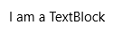
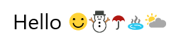
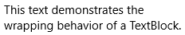
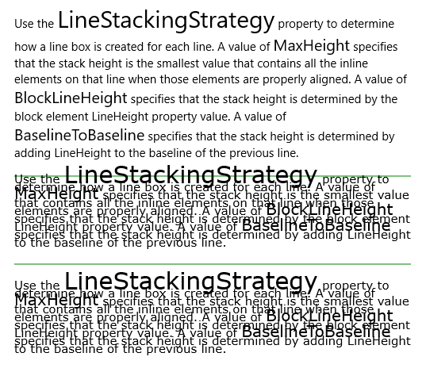

<!-- Class syntax.
public class TextBlock : Windows.UI.Xaml.FrameworkElement, Windows.UI.Xaml.Controls.ITextBlock, Windows.UI.Xaml.Controls.ITextBlock2, Windows.UI.Xaml.Controls.ITextBlock3, Windows.UI.Xaml.Controls.ITextBlock4, Windows.UI.Xaml.Controls.ITextBlock5
-->

# Windows.UI.Xaml.Controls.TextBlock

## -description

Provides a lightweight control for displaying small amounts of text.


## -xaml-syntax

```xaml
<TextBlock ...>text</TextBlock>
-or-
<TextBlock>
  oneOrMoreInlineElements
</TextBlock>
-or-
<TextBlock .../>
```

## -remarks

> [!TIP]
> For more info, design guidance, and code examples, see [Text block](/windows/uwp/design/controls-and-patterns/text-block).

TextBlock is the primary control for displaying read-only text in apps. You can use it to display single-line or multi-line text, inline hyperlinks, and text with formatting like bold, italic, or underlined.



 TextBlock is typically easier to use and provides better text rendering performance than [RichTextBlock](richtextblock.md), so it's preferred for most app UI text. It also provides many of the same formatting options for customizing how your text is rendered. Although you can put line breaks in the text, TextBlock is designed to display a single paragraph and doesn’t support text indentation. Consider a [RichTextBlock](richtextblock.md) if you need support for multiple paragraphs, multi-column text, or inline UI elements like images.

### Text performance

Starting in Windows 10, performance improvements were made to TextBlock that decrease overall memory use and greatly reduce the CPU time to do text measuring and arranging. To find out more about these performance improvements and how to make sure you are using them, see the Performance considerations section of the [TextBlock control guide](/windows/uwp/controls-and-patterns/text-block).

### Built-in text styles

You can use Windows 10 text styles that ship with the platform to align the style of your text with the text used in the system. Here's how to use built-in styles to align with the Windows 10 type ramp. For more info, see [XAML theme resources](/windows/apps/design/style/xaml-theme-resources).

```xaml
<TextBlock Text="Header" Style="{StaticResource HeaderTextBlockStyle}"/>
<TextBlock Text="SubHeader" Style="{StaticResource SubheaderTextBlockStyle}"/>
<TextBlock Text="Title" Style="{StaticResource TitleTextBlockStyle}"/>
<TextBlock Text="SubTitle" Style="{StaticResource SubtitleTextBlockStyle}"/>
<TextBlock Text="Base" Style="{StaticResource BaseTextBlockStyle}"/>
<TextBlock Text="Body" Style="{StaticResource BodyTextBlockStyle}"/>
<TextBlock Text="Caption" Style="{StaticResource CaptionTextBlockStyle}"/>
```

The rendered text looks like this:


### Color fonts

By default TextBlock supports display color fonts. The default color font on the system is Segoe UI Emoji and the TextBlock will fall back to this font to display the glyphs in color. For more info, see the [IsColorFontEnabled](textblock_iscolorfontenabled.md) property.

```xaml
<TextBlock FontSize="30">Hello ☺⛄☂♨⛅</TextBlock>
```

The rendered text looks like this:



### Version history

| Windows version | SDK version | Value added |
| -- | -- | -- |
| 1607 | 14393 | GetAlphaMask |
| 1703 | 15063 | TextDecorations |
| 1709 | 16299 | HorizontalTextAlignment |
| 1709 | 16299 | IsTextTrimmed |
| 1709 | 16299 | IsTextTrimmedChanged |
| 1709 | 16299 | TextHighlighters |
| 1809 | 17763 | CopySelectionToClipboard |
| 1809 | 17763 | SelectionFlyout |

## -examples

> [!TIP]
> For more info, design guidance, and code examples, see [Text block](/windows/apps/design/controls/text-block).

> [!div class="nextstepaction"]
> [Open the WinUI 2 Gallery app and see the TextBlock in action](winui2gallery:/item/TextBlock)

> The **WinUI 2 Gallery** app includes interactive examples of most WinUI 2 controls, features, and functionality. Get the app from the [Microsoft Store](https://www.microsoft.com/store/productId/9MSVH128X2ZT) or get the source code on [GitHub](https://github.com/Microsoft/WinUI-Gallery/tree/winui2).

This example demonstrates a TextBlock with text selection enabled and text wrapping enabled.

> [!IMPORTANT]
> If using a keyboard for text selection within a TextBlock, the user must first activate *Caret Browsing* (with the app in the foreground, press F7).

The rendered text looks like this:



```xaml
<TextBlock Text="This text demonstrates the wrapping behavior of a TextBlock." Width="240"
           IsTextSelectionEnabled="True" TextWrapping="Wrap"/>
```

```csharp
TextBlock textBlock = new TextBlock();
textBlock.Text = "This text demonstrates the wrapping behavior of a TextBlock.";
textBlock.Width = 240;
textBlock.IsTextSelectionEnabled = true;
textBlock.TextWrapping = TextWrapping.Wrap;

// Add TextBlock to the visual tree.
rootPanel.Children.Add(textBlock);
```

This example shows how to customize the appearance of a TextBlock with a single [Run](../windows.ui.xaml.documents/run.md) of text. The [FontWeight](textblock_fontweight.md), [FontFamily](textblock_fontfamily.md), [FontStyle](textblock_fontstyle.md), [Foreground](textblock_foreground.md) color, and [SelectionHighlightColor](textblock_selectionhighlightcolor.md) properties are customized.

The rendered text looks like this:


```xaml
<TextBlock Text="This text demonstrates some TextBlock properties." 
           IsTextSelectionEnabled="True" 
           SelectionHighlightColor="Green" 
           Foreground="Blue" 
           FontWeight="Light" 
           FontFamily="Arial" 
           FontStyle="Italic"/>
```

```csharp
TextBlock textBlock = new TextBlock();
textBlock.Text = "This text demonstrates some TextBlock properties.";
textBlock.IsTextSelectionEnabled = true;
textBlock.SelectionHighlightColor = new SolidColorBrush(Windows.UI.Colors.Green);
textBlock.Foreground = new SolidColorBrush(Windows.UI.Colors.Blue);
textBlock.FontWeight = Windows.UI.Text.FontWeights.Light;
textBlock.FontFamily = new FontFamily("Arial");
textBlock.FontStyle = Windows.UI.Text.FontStyle.Italic;

// Add TextBlock to the visual tree.
rootPanel.Children.Add(textBlock);
```

This example demonstrates customizing different inline elements within a TextBlock.

The rendered text looks like this:


```xaml
<TextBlock IsTextSelectionEnabled="True" SelectionHighlightColor="Green" FontFamily="Arial">
    <Run Foreground="Blue" FontWeight="Light" Text="This text demonstrates "></Run>
    <Span FontWeight="SemiBold">
        <Run FontStyle="Italic">the use of inlines </Run>
        <Run Foreground="Red">with formatting.</Run>
    </Span>
</TextBlock>
```

```csharp
TextBlock textBlock = new TextBlock();
textBlock.IsTextSelectionEnabled = true;
textBlock.SelectionHighlightColor = new SolidColorBrush(Windows.UI.Colors.Green);
textBlock.FontFamily = new FontFamily("Arial");

// For Run and Span, add 'using Windows.UI.Xaml.Documents;'
Windows.UI.Xaml.Documents.Run run = new Run();
run.Foreground = new SolidColorBrush(Windows.UI.Colors.Blue);
run.FontWeight = Windows.UI.Text.FontWeights.Light;
run.Text = "This text demonstrates ";

Windows.UI.Xaml.Documents.Span span = new Span();
span.FontWeight = Windows.UI.Text.FontWeights.SemiBold;

Run run1 = new Run();
run1.FontStyle = Windows.UI.Text.FontStyle.Italic;
run1.Text = "the use of inlines ";

Run run2 = new Run();
run2.Foreground = new SolidColorBrush(Windows.UI.Colors.Red);
run2.Text = "with formatting.";

span.Inlines.Add(run1);
span.Inlines.Add(run2);
textBlock.Inlines.Add(run);
textBlock.Inlines.Add(span);

// Add TextBlock to the visual tree.
rootPanel.Children.Add(textBlock);
```

This example shows how to use an inline hyperlink. For more info, see [Hyperlink](../windows.ui.xaml.documents/hyperlink.md).

```xaml
<TextBlock><Hyperlink xml:space="preserve" NavigateUri="http://www.bing.com"> Hyperlink to Bing </Hyperlink></TextBlock>
```

```csharp
// Create a TextBlock this is needed to put the hyperlink inside
TextBlock textBlock = new TextBlock();

// Create a Hyperlink and a Run. 
// The Run is used as the visible content of the hyperlink.
Hyperlink hyperlink = new Hyperlink();
Run run = new Run();

// Set the Text property on the run. 
// This is the visible text of the hyperlink.
run.Text = " Hyperlink to Bing ";

// Add the Run to the Hyperlink. 
hyperlink.Inlines.Add(run);

// Set the URI for the Hyperlink. 
hyperlink.NavigateUri = new Uri("http://www.bing.com");

// Add the Hyperlink to the TextBlock.
textBlock.Inlines.Add(hyperlink);

// Add TextBlock to the visual tree.        
rootPanel.Children.Add(textBlock);
```

The following example shows how to use the [LineStackingStrategy](textblock_linestackingstrategy.md) property to determine how the line boxes are created for text lines of a TextBlock. The first TextBlock has a [LineStackingStrategy](textblock_linestackingstrategy.md) value of **MaxHeight**,the second TextBlock has a value of **BlockLineHeight**, and the third TextBlock has a value of **BaselineToBaseline**.

The rendered text looks like this:



[!code-xaml[LineStackingStrategyExampleWholePage](../windows.ui.xaml.controls/code/TextBlock.LineStackingStrategy/csharp/Page.xaml#SnippetLineStackingStrategyExampleWholePage)]

## -see-also

[Text block overview](/windows/uwp/design/controls-and-patterns/text-block), [RichTextBlock](richtextblock.md), [TextBox](textbox.md), [Controls list](/windows/uwp/design/controls-and-patterns/), [Controls by function](/windows/uwp/controls-and-patterns/controls-by-function)
