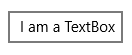
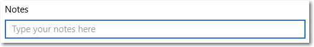
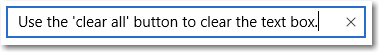
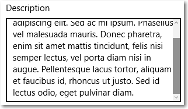
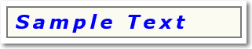

<!-- Class syntax.
public class TextBox : Windows.UI.Xaml.Controls.Control, Windows.UI.Xaml.Controls.ITextBox, Windows.UI.Xaml.Controls.ITextBox2, Windows.UI.Xaml.Controls.ITextBox3, Windows.UI.Xaml.Controls.ITextBox4, Windows.UI.Xaml.Controls.ITextBox5
-->

# Windows.UI.Xaml.Controls.TextBox

## -description

Represents a control that can be used to display and edit plain text (single or multi-line).


## -xaml-syntax

```xaml
<TextBox .../>
```

## -remarks

> [!TIP]
> For more info, design guidance, and code examples, see [Text box](/windows/uwp/design/controls-and-patterns/text-box).



The TextBox control enables a user to enter text into an app. It's typically used to capture a single line of text, but can be configured to capture multiple lines of text. The text displays on the screen in a simple uniform plaintext format.

TextBox has a number of features that can simplify text entry:

- It supports text input from a keyboard  or a pen (using ink and handwriting recognition).
- It comes with a familiar, built-in context menu with support for copying and pasting text.
- A "clear all" button lets a user quickly delete all text that has been entered.
- It also has spell checking capabilities built in and enabled by default.

Here's how to create a TextBox in XAML and in code.

```xaml
<TextBox Width="500" Header="Notes" PlaceholderText="Type your notes here"/>
```

```csharp
TextBox textBox = new TextBox();
textBox.Width = 500;
textBox.Header = "Notes";
textBox.PlaceholderText = "Type your notes here";
// Add the TextBox to the visual tree.
rootGrid.Children.Add(textBox);
```

The resulting TextBox looks like this. The blue border indicates that the TextBox has focus.



### Is TextBox the right control to use?
You can use a TextBox control to display and edit unformatted text. If you need an editable text box that accepts passwords or other sensitive input, see [PasswordBox](passwordbox.md). If you need a text box to enter search terms, see [AutoSuggestBox](autosuggestbox.md). If you need to enter or edit formatted text, see [RichEditBox](richeditbox.md).

### Use TextBox for data input in a form

It’s common to use a TextBox to accept data input on a form, and use the [Text](textbox_text.md) property to get the complete text string from the TextBox. You typically use an event like a submit button Click to access the [Text](textbox_text.md) property, but you can handle the [TextChanged](textbox_textchanged.md) or [TextChanging](textbox_textchanging.md) event if you need to do something when the text changes. You can add a [Header](textbox_header.md) (or label) and [PlaceholderText](textbox_placeholdertext.md) (or watermark) to the TextBox to give the user an indication of what the TextBox is for. To customize the look of the header, you can set the [HeaderTemplate](textbox_headertemplate.md) property instead of [Header](textbox_header.md). For design info, see [Guidelines for labels](/windows/uwp/controls-and-patterns/labels).

You can restrict the number of characters the user can type by setting the [MaxLength](textbox_maxlength.md) property. However, [MaxLength](textbox_maxlength.md) does not restrict the length of pasted text. Use the [Paste](textbox_paste.md) event to modify pasted text if this is important for your app.

TextBox includes a *clear all* button ("x") that appears when text is entered in the box. When a user clicks the "x", the text in the TextBox is cleared. It looks like this.



The *clear all* button is shown only for editable, single-line text boxes that contain text and have focus.
The *clear all* button is not shown in any of these cases:

+ [IsReadOnly](textbox_isreadonly.md) is **true**
+ [AcceptsReturn](textbox_acceptsreturn.md) is **true**
+ [TextWrapping](textbox_textwrapping.md) is **Wrap**

### Make a TextBox read-only

You can make a TextBox read-only by setting the [IsReadOnly](textbox_isreadonly.md) property to **true**. For example, you might have a TextBox for a user to enter comments that is enabled only under certain conditions. You can make the TextBox read-only until the conditions are met. If you need only to display text, consider using a [TextBlock](textblock.md) or [RichTextBlock](richtextblock.md) instead.

### Enable multi-line input

There are two properties that control whether the TextBox displays text on more than one line. 
+ To let the text box allow and display the newline or return characters, set the [AcceptsReturn](textbox_acceptsreturn.md) property to **true**.
+ To enable text wrapping, set the [TextWrapping](textbox_textwrapping.md) property to **Wrap**. (TextBox doesn't support the **TextWrapping.WrapWholeWords** enumeration value.)
 A multi-line TextBox will continue to grow vertically as text is entered unless it’s constrained by its [Height](../windows.ui.xaml/frameworkelement_height.md) or [MaxHeight](../windows.ui.xaml/frameworkelement_maxheight.md) property, or by a parent container. You should test that a multi-line TextBox doesn’t grow beyond its visible area, and constrain its growth if it does. Scrolling using a scroll-wheel or touch is automatically enabled when needed. However, vertical scrollbars are not shown by default. You can show the vertical scrollbars by setting the [ScrollViewer.VerticalScrollBarVisibility](scrollviewer_verticalscrollbarvisibility.md) to **Auto** on the embedded [ScrollViewer](scrollviewer.md), as shown here.

```xaml
<TextBox AcceptsReturn="True" TextWrapping="Wrap" 
         MaxHeight="172" Width="300" Header="Description"
         ScrollViewer.VerticalScrollBarVisibility="Auto"/>
```

```csharp
TextBox textBox = new TextBox();
textBox.AcceptsReturn = true;
textBox.TextWrapping = TextWrapping.Wrap;
textBox.MaxHeight = 172;
textBox.Width = 300;
textBox.Header = "Description";
ScrollViewer.SetVerticalScrollBarVisibility(textBox, ScrollBarVisibility.Auto);
```

Here's what the TextBox looks like after text is added.



### Format the text display

Use the [TextAlignment](textbox_textalignment.md) property to align text within a TextBox. To align the TextBox within the layout of the page, use the [HorizontalAlignment](../windows.ui.xaml/frameworkelement_horizontalalignment.md) and [VerticalAlignment](../windows.ui.xaml/frameworkelement_verticalalignment.md) properties.

While the TextBox supports only unformatted text, you can customize how the text is displayed in the TextBox to match your branding. You can set standard [Control](control.md) properties like [FontFamily](control_fontfamily.md), [FontSize](control_fontsize.md), [FontStyle](control_fontstyle.md), [Background](control_background.md), [Foreground](control_foreground.md), and [CharacterSpacing](control_characterspacing.md) to change the look of the text. These properties affect only how the TextBox displays the text locally, so if you were to copy and paste the text into a rich text control, for example, no formatting would be applied.

This example shows a read-only TextBox with several properties set to customize the appearance of the text.

```xaml
<TextBox Text="Sample Text" IsReadOnly="True" 
         FontFamily="Verdana" FontSize="24"
         FontWeight="Bold" FontStyle="Italic" 
         CharacterSpacing="200" Width="300"
         Foreground="Blue" Background="Beige"/>
```

```csharp
TextBox textBox = new TextBox();
textBox.Text = "Sample Text";
textBox.IsReadOnly = true;
textBox.FontFamily = new FontFamily("Verdana");
textBox.FontSize = 24;
textBox.FontWeight = Windows.UI.Text.FontWeights.Bold;
textBox.FontStyle = Windows.UI.Text.FontStyle.Italic;
textBox.CharacterSpacing = 200;
textBox.Width = 300;
textBox.Background = new SolidColorBrush(Windows.UI.Colors.Beige);
textBox.Foreground = new SolidColorBrush(Windows.UI.Colors.Blue);
// Add the TextBox to the visual tree.
rootGrid.Children.Add(textBox);
```

The resulting TextBox looks like this.



### Pen input

Starting with Windows 10, version 1803, XAML text input boxes feature embedded support for pen input using [Windows Ink](/windows/uwp/input-and-devices/pen-and-stylus-interactions). When a user taps into a text input box using a Windows pen, the text box transforms to let the user write directly into it with a pen, rather than opening a separate input panel.


For more info, see [Text input with the handwriting view](/windows/uwp/design/controls-and-patterns/text-handwriting-view).

### Modify the context menu

By default, the commands shown in the TextBox context menu depend on the state of the TextBox. For example, the following commands can be shown when the TextBox is editable.<table>
   <tr><th>Command</th><th>Shown when...</th></tr>
   <tr><td>Copy</td><td>text is selected.</td></tr>
   <tr><td>Cut</td><td>text is selected.</td></tr>
   <tr><td>Paste</td><td>the clipboard contains text.</td></tr>
   <tr><td>Select all</td><td>the TextBox contains text.</td></tr>
   <tr><td>Undo</td><td>text has been changed.</td></tr>
</table>

To modify the commands shown in the context menu, handle the [ContextMenuOpening](textbox_contextmenuopening.md) event. For an example of this, see the **Customizing RichEditBox's CommandBarFlyout - adding 'Share'** example in the <a href="winui2gallery:/item/RichEditBox">WinUI 2 Gallery</a>. For design info, see [Guidelines for context menus](/windows/uwp/design/controls-and-patterns/menus).

### Selection, copy, and paste

You can get or set the selected text in a TextBox using the [SelectedText](textbox_selectedtext.md) property. Use the [SelectionStart](textbox_selectionstart.md) and [SelectionLength](textbox_selectionlength.md) properties, and the [Select](textbox_select_1267437592.md) and [SelectAll](textbox_selectall_1125513670.md) methods, to manipulate the text selection. Handle the [SelectionChanged](textbox_selectionchanged.md) event to do something when the user selects or de-selects text. You can change the color used to highlight the selected text by setting the [SelectionHighlightColor](textbox_selectionhighlightcolor.md) property.

TextBox supports copy and paste by default. You can provide custom handling of the [Paste](textbox_paste.md) event on editable text controls in your app. For example, you might remove the line breaks from a multi-line address when pasting it into a single-line search box. Or, you might check the length of the pasted text and warn the user if it exceeds the maximum length that can be saved to a database. For more info and examples, see the [Paste](textbox_paste.md) event.

### Use a text box with the touch keyboard

The touch keyboard can be used for text entry when your app runs on a device with a touch screen. TextBox provides properties you can set to make it much faster and easier for users to enter data in your app using the touch keyboard. Set the [InputScope](textbox_inputscope.md) property to match the kind of data the user is expected to enter. For example, if a TextBox is used only to enter a 4-digit PIN, set the [InputScope](textbox_inputscope.md) property to Number. This tells the system to show the number keypad layout, which makes it easier for the user to enter the PIN.

Other properties that affect the touch keyboard are [IsSpellCheckEnabled](textbox_isspellcheckenabledproperty.md), [IsTextPredictionEnabled](textbox_istextpredictionenabledproperty.md), and [PreventKeyboardDisplayOnProgrammaticFocus](textbox_preventkeyboarddisplayonprogrammaticfocus.md). ([IsSpellCheckEnabled](textbox_isspellcheckenabledproperty.md) also affects the TextBox when a hardware keyboard is used.) For more info and examples, see [Use input scope to change the touch keyboard](/windows/uwp/design/input/use-input-scope-to-change-the-touch-keyboard), and the property documentation.

### Control style and template

You can modify the default [Style](../windows.ui.xaml/style.md) and [ControlTemplate](controltemplate.md) to give the control a unique appearance. For information about modifying a control's style and template, see [Styling controls](/windows/uwp/controls-and-patterns/styling-controls). The default style, template, and resources that define the look of the control are included in the `generic.xaml` file. For design purposes, `generic.xaml` is available locally with the SDK or NuGet package installation.

- **[WinUI Styles (recommended)](/windows/apps/design/style/xaml-styles#winui-and-styles):** For updated styles from WinUI, see `\Users\<username>\.nuget\packages\microsoft.ui.xaml\<version>\lib\uap10.0\Microsoft.UI.Xaml\Themes\generic.xaml`.
- **Non-WinUI styles:** For built-in styles, see `%ProgramFiles(x86)%\Windows Kits\10\DesignTime\CommonConfiguration\Neutral\UAP\<SDK version>\Generic\generic.xaml`.

Locations might be different if you customized the installation. Styles and resources from different versions of the SDK might have different values.

XAML also includes resources that you can use to modify the colors of a control in different visual states without modifying the control template. Modifying these resources is preferred to setting properties such as [Background](control_background.md) and [Foreground](control_foreground.md). For more info, see the [Light-weight styling](/windows/apps/design/style/xaml-styles#lightweight-styling) section of the [XAML styles](/windows/apps/design/style/xaml-styles) article. Light-weight styling resources are available starting in Windows 10, version 1607 (SDK 14393).

Resources that start with `TextControl` are shared by `TextBox`, [PasswordBox](passwordbox.md), [RichEditBox](richeditbox.md), and [AutoSuggestBox](autosuggestbox.md). Changes to these resources will affect all four controls.

### Version history

| Windows version | SDK version | Value added |
| -- | -- | -- |
| 1511 | 10586 | GetLinguisticAlternativesAsync |
| 1703 | 15063 | SelectionHighlightColorWhenNotFocused |
| 1709 | 16299 | BeforeTextChanging |
| 1709 | 16299 | CharacterCasing |
| 1709 | 16299 | CopyingToClipboard |
| 1709 | 16299 | CuttingToClipboard |
| 1709 | 16299 | HorizontalTextAlignment |
| 1709 | 16299 | PlaceholderForeground |
| 1803 | 17134 | HandwritingView |
| 1803 | 17134 | IsHandwritingViewEnabled |
| 1809 | 17763 | CanPasteClipboardContent |
| 1809 | 17763 | CanRedo |
| 1809 | 17763 | CanUndo |
| 1809 | 17763 | ClearUndoRedoHistory |
| 1809 | 17763 | CopySelectionToClipboard |
| 1809 | 17763 | CutSelectionToClipboard |
| 1809 | 17763 | Description |
| 1809 | 17763 | PasteFromClipboard |
| 1809 | 17763 | ProofingMenuFlyout |
| 1809 | 17763 | Redo |
| 1809 | 17763 | SelectionChanging |
| 1809 | 17763 | SelectionFlyout |
| 1809 | 17763 | Undo |

## -examples

> [!TIP]
> For more info, design guidance, and code examples, see [Text box](/windows/apps/design/controls/text-box).

> [!div class="nextstepaction"]
> [Open the WinUI 2 Gallery app and see the TextBox in action](winui2gallery:/item/TextBox)

> The **WinUI 2 Gallery** app includes interactive examples of most WinUI 2 controls, features, and functionality. Get the app from the [Microsoft Store](https://www.microsoft.com/store/productId/9MSVH128X2ZT) or get the source code on [GitHub](https://github.com/Microsoft/WinUI-Gallery/tree/winui2).

This example shows a TextBox with a header and placeholder text. The [Text](textbox_text.md) from the TextBox is used to show a greeting to the user.

```xaml
<StackPanel>
    <TextBlock Text="What's your name?"/>
        <StackPanel Orientation="Horizontal" Margin="0,20,0,20">

            <TextBox x:Name="nameInput"
                     Header="Enter your name:" PlaceholderText="Name"
                     Width="300" HorizontalAlignment="Left"/>

            <Button Content="Hello button" Click="Button_Click"/>
        </StackPanel>
    <TextBlock x:Name="greetingOutput"/>
</StackPanel>
```

```csharp
private void Button_Click(object sender, RoutedEventArgs e)
{
    greetingOutput.Text = "Hello, " + nameInput.Text + "!";
}
```

## -see-also

[Text box overview](/windows/uwp/design/controls-and-patterns/text-box), [How to use input scope to change the touch keyboard](/windows/uwp/design/input/use-input-scope-to-change-the-touch-keyboard), [XAML text editing sample](https://github.com/microsoftarchive/msdn-code-gallery-microsoft/tree/master/Official%20Windows%20Platform%20Sample/XAML%20text%20editing%20sample), [Guidelines for spell checking](/windows/uwp/controls-and-patterns/spell-checking-and-prediction), [PasswordBox](passwordbox.md), [RichEditBox](richeditbox.md), [RichTextBlock](richtextblock.md), [SearchBox](searchbox.md), [Controls list](/windows/uwp/design/controls-and-patterns/), [Controls by function](/windows/uwp/controls-and-patterns/controls-by-function), [Touch keyboard text input sample (Windows 10)](https://go.microsoft.com/fwlink/p/?LinkId=690716)
