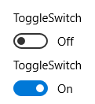

<!-- Class syntax.
public class ToggleSwitch : Windows.UI.Xaml.Controls.Control, Windows.UI.Xaml.Controls.IToggleSwitch, Windows.UI.Xaml.Controls.IToggleSwitchOverrides
-->

# Windows.UI.Xaml.Controls.ToggleSwitch

## -description
Represents a switch that can be toggled between two states.


## -xaml-syntax
```xaml
<ToggleSwitch .../>
-or-
<ToggleSwitch ...>
  oneOrMorePropertyElementComponents
</ToggleSwitch>
```


## -remarks

> [!TIP]
> For more info, design guidance, and code examples, see [Toggle switches](/windows/uwp/design/controls-and-patterns/toggles).

ToggleSwitch is a control that can be toggled between 2 states.



Use a ToggleSwitch control to let the user switch an option between on and off states. Use the [IsOn](toggleswitch_ison.md) property to determine the state of the switch. Handle the [Toggled](toggleswitch_toggled.md) event to respond to changes in the state.

### Control style and template

You can modify the default [Style](../windows.ui.xaml/style.md) and [ControlTemplate](controltemplate.md) to give the control a unique appearance. For information about modifying a control's style and template, see [Styling controls](/windows/uwp/controls-and-patterns/styling-controls). The default style, template, and resources that define the look of the control are included in the `generic.xaml` file. For design purposes, `generic.xaml` is available locally with the SDK or NuGet package installation.

- **[WinUI Styles (recommended)](/windows/apps/design/style/xaml-styles#winui-and-styles):** For updated styles from WinUI, see `\Users\<username>\.nuget\packages\microsoft.ui.xaml\<version>\lib\uap10.0\Microsoft.UI.Xaml\Themes\generic.xaml`.
- **Non-WinUI styles:** For built-in styles, see `%ProgramFiles(x86)%\Windows Kits\10\DesignTime\CommonConfiguration\Neutral\UAP\<SDK version>\Generic\generic.xaml`.

Locations might be different if you customized the installation. Styles and resources from different versions of the SDK might have different values.

XAML also includes resources that you can use to modify the colors of a control in different visual states without modifying the control template. Modifying these resources is preferred to setting properties such as [Background](control_background.md) and [Foreground](control_foreground.md). For more info, see the [Light-weight styling](/windows/apps/design/style/xaml-styles#lightweight-styling) section of the [XAML styles](/windows/apps/design/style/xaml-styles) article. Light-weight styling resources are available starting in Windows 10, version 1607 (SDK 14393).

## -examples

> [!TIP]
> For more info, design guidance, and code examples, see [Toggle switch](/windows/apps/design/controls/toggles).

> [!div class="nextstepaction"]
> [Open the WinUI 2 Gallery app and see the ToggleSwitch in action](winui2gallery:/item/ToggleSwitch)

> The **WinUI 2 Gallery** app includes interactive examples of most WinUI 2 controls, features, and functionality. Get the app from the [Microsoft Store](https://www.microsoft.com/store/productId/9MSVH128X2ZT) or get the source code on [GitHub](https://github.com/Microsoft/WinUI-Gallery/tree/winui2).

This example shows how to set the [Header](toggleswitch_header.md), [OnContent](toggleswitch_oncontent.md), and [OffContent](toggleswitch_offcontent.md) properties of a toggle switch. The [Toggled](toggleswitch_toggled.md) event is handled to turn a [ProgressRing](progressring.md) control on or off.

```xaml
<StackPanel Orientation="Horizontal">
    <ToggleSwitch Header="Toggle Switch Example" 
        OffContent="Do work" OnContent="Working" 
        Toggled="ToggleSwitch_Toggled"/>  
    <ProgressRing x:Name="progress1"/>
</StackPanel>
```

```csharp
        private void ToggleSwitch_Toggled(object sender, RoutedEventArgs e)
        {
            ToggleSwitch toggleSwitch = sender as ToggleSwitch;
            if (toggleSwitch != null)
            {
                if (toggleSwitch.IsOn == true)
                {
                    progress1.IsActive = true;
                    progress1.Visibility = Visibility.Visible;
                }
                else
                {
                    progress1.IsActive = false;
                    progress1.Visibility = Visibility.Collapsed;
                }
            }
        }
```

```cppwinrt
using namespace winrt::Windows::UI::Xaml::Controls;
void MainPage::ToggleSwitch_Toggled(IInspectable const& sender, RoutedEventArgs const& /* args */)
{
    ToggleSwitch toggleSwitch = sender.as<ToggleSwitch>();
    if (toggleSwitch)
    {
        if (toggleSwitch.IsOn())
        {
            progress1().IsActive(true);
            progress1().Visibility(Visibility::Visible);
        }
        else
        {
            progress1().IsActive(false);
            progress1().Visibility(Visibility::Collapsed);
        }
    }
}
```

## -see-also
[Toggle switches overview](/windows/uwp/controls-and-patterns/toggles), [CheckBox](checkbox.md), [RadioButton](radiobutton.md), [Controls list](/windows/uwp/design/controls-and-patterns/), [Controls by function](/windows/uwp/controls-and-patterns/controls-by-function)
