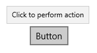

<!-- Class syntax.
public class ToolTip : Windows.UI.Xaml.Controls.ContentControl, Windows.UI.Xaml.Controls.IToolTip
-->

# Windows.UI.Xaml.Controls.ToolTip

## -description

Represents a pop-up window for displaying information about an element in the UI.


## -xaml-syntax

```xaml
<ToolTip .../>
-or-
<ToolTip ...>
  singleObject
</ToolTip ...>
-or-
<ToolTip ...>stringContent</ToolTip>
```


## -remarks

A tooltip is a popup that contains additional information about another control or object. Tooltips display automatically when the user moves focus to, presses and holds, or hovers the pointer over the associated control. The tooltip disappears when the user moves focus from, stops pressing on, or stops hovering the pointer over the associated control (unless the pointer is moving towards the tooltip).

> [!NOTE]
> Starting with Windows 11 version 21H2, a tooltip can also be dismissed by pressing the CTRL key.

Here's a ToolTip for a [Button](button.md).



For design guidelines, see [Guidelines for tooltips](/windows/uwp/controls-and-patterns/tooltips).

### Usage

A ToolTip must be assigned to another UI element that is its owner. The [ToolTipService](tooltipservice.md) class provides static methods to display a ToolTip.

+ In XAML, use the [ToolTipService.Tooltip](/uwp/api/windows.ui.xaml.controls.tooltipservice.tooltip) attached property to assign the ToolTip to an owner.
```xaml
<Button Content="Submit" ToolTipService.ToolTip="Click to submit"/>
```

+ In code, use the [ToolTipService.SetToolTip](tooltipservice_settooltip_1924909593.md) method to assign the ToolTip to an owner.
```xaml
<Button x:Name="submitButton" Content="Submit"/>
```

```csharp
ToolTip toolTip = new ToolTip();
toolTip.Content = "Click to submit";
ToolTipService.SetToolTip(submitButton, toolTip);
```

You can use any object as the [Content](contentcontrol_content.md) of a ToolTip. Here's an example of using an [Image](image.md) in a ToolTip.

```xaml
<TextBlock Text="store logo">
    <ToolTipService.ToolTip>
        <Image Source="Assets/StoreLogo.png"/>
    </ToolTipService.ToolTip>
</TextBlock> 
```

### Placement

By default, a ToolTip is displayed centered above the pointer. The placement is not constrained by the app window, so the ToolTip might be displayed partially or completely outside of the app window bounds.

If a ToolTip obscures the content it is referring to, you can adjust its placement. Use the [Placement](tooltip_placement.md) property or [ToolTipService.Placement](/uwp/api/windows.ui.xaml.controls.tooltipservice.placement) attached property to place the ToolTip above, below, left, or right of the pointer. You can set the [VerticalOffset](tooltip_verticaloffset.md) and [HorizontalOffset](tooltip_horizontaloffset.md) properties to change the distance between the pointer and the ToolTip.

### Control style and template

You can modify the default [Style](../windows.ui.xaml/style.md) and [ControlTemplate](controltemplate.md) to give the control a unique appearance. For information about modifying a control's style and template, see [Styling controls](/windows/uwp/controls-and-patterns/styling-controls). The default style, template, and resources that define the look of the control are included in the `generic.xaml` file. For design purposes, `generic.xaml` is available locally with the SDK or NuGet package installation.

- **[WinUI Styles (recommended)](/windows/apps/design/style/xaml-styles#winui-and-styles):** For updated styles from WinUI, see `\Users\<username>\.nuget\packages\microsoft.ui.xaml\<version>\lib\uap10.0\Microsoft.UI.Xaml\Themes\generic.xaml`.
- **Non-WinUI styles:** For built-in styles, see `%ProgramFiles(x86)%\Windows Kits\10\DesignTime\CommonConfiguration\Neutral\UAP\<SDK version>\Generic\generic.xaml`.

Locations might be different if you customized the installation. Styles and resources from different versions of the SDK might have different values.

XAML also includes resources that you can use to modify the colors of a control in different visual states without modifying the control template. Modifying these resources is preferred to setting properties such as [Background](control_background.md) and [Foreground](control_foreground.md). For more info, see the [Light-weight styling](/windows/apps/design/style/xaml-styles#lightweight-styling) section of the [XAML styles](/windows/apps/design/style/xaml-styles) article. Light-weight styling resources are available starting in Windows 10, version 1607 (SDK 14393).

### Notes for previous versions

> **Windows 8.x**
> ToolTip is intended only for use in Windows. The ToolTip type is available in Windows Phone projects for compatibility with universal project templates, but the ToolTip is not shown in the Windows Phone  UI.
>
> ToolTip is displayed only within the bounds of the app window. It's placement might be adjusted to stay within those bounds.

### Version history

| Windows version | SDK version | Value added |
| -- | -- | -- |
| 1809 | 17763 | PlacementRect |

## -examples

> [!TIP]
> For more info, design guidance, and code examples, see [Tooltip](/windows/apps/design/controls/tooltips).

> [!div class="nextstepaction"]
> [Open the WinUI 2 Gallery app and see the Tooltip in action](winui2gallery:/item/Tooltip)

> The **WinUI 2 Gallery** app includes interactive examples of most WinUI 2 controls, features, and functionality. Get the app from the [Microsoft Store](https://www.microsoft.com/store/productId/9MSVH128X2ZT) or get the source code on [GitHub](https://github.com/Microsoft/WinUI-Gallery/tree/winui2).

This example demonstrates basic tooltips and the properties for placement.

[!code-xaml[1](../windows.ui.xaml.controls.primitives/code/System.Windows.Controls.ToolTip/csharp/Page.xaml#Snippet1)]

## -see-also
[ContentControl](contentcontrol.md), [ToolTipService](tooltipservice.md), [Tooltips overview](/windows/uwp/design/controls-and-patterns/tooltips), [XAML essential controls sample](https://github.com/microsoftarchive/msdn-code-gallery-microsoft/tree/master/Official%20Windows%20Platform%20Sample/Windows%208.1%20Store%20app%20samples/99866-Windows%208.1%20Store%20app%20samples/XAML%20essential%20controls%20sample)
