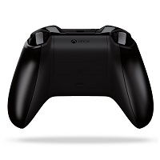

<!-- Class syntax.
public class KeyRoutedEventArgs : Windows.UI.Xaml.RoutedEventArgs, Windows.UI.Xaml.Input.IKeyRoutedEventArgs, Windows.UI.Xaml.Input.IKeyRoutedEventArgs2, Windows.UI.Xaml.Input.IKeyRoutedEventArgs3
-->

# Windows.UI.Xaml.Input.KeyRoutedEventArgs

## -description

Provides event data for the [KeyUp](../windows.ui.xaml/uielement_keyup.md) and [KeyDown](../windows.ui.xaml/uielement_keydown.md) routed events.

## -remarks

Button input is mapped to different key values for various devices.

This table provides the mapping detail for game pad and remote devices.

<table>
   <tr><th>Button</th><th>[Key](keyroutedeventargs_key.md) value</th><th>[OriginalKey](keyroutedeventargs_originalkey.md) value</th></tr>
   <tr><td></td><td>Space</td><td>GamepadA or NavigationAccept</td></tr>
   <tr><td></td><td>Escape</td><td>GamepadB or NavigationCancel</td></tr>
   <tr><td></td><td>GamepadX</td><td>GamepadX</td></tr>
   <tr><td></td><td>GamepadY</td><td>GamepadY</td></tr>
   <tr><td>

 50</td><td>GamepadDPadUp/Down/Left/Right</td><td>GamepadDPadUp/Down/Left/Right or NavigationUp/Down/Left/Right</td></tr>
   <tr><td></td><td>GamepadLeftThumbstickButton/Up/Down/Left/Right or GamepadRightThumbstickButton/Up/Down/Left/Right</td><td>GamepadLeftThumbstickButton/Up/Down/Left/Right or GamepadRightThumbstickButton/Up/Down/Left/Right or NavigationUp/Down/Left/Right</td></tr>
   <tr><td></td><td>GamePadRightTrigger/LeftTrigger</td><td>GamePadRightTrigger/LeftTrigger</td></tr>
   <tr><td></td><td>GamePadRightShoulder/LeftShoulder</td><td>GamePadRightShoulder/LeftShoulder</td></tr>
   <tr><td></td><td>GamepadMenu</td><td>GamepadMenu or NavigationMenu</td></tr>
   <tr><td></td><td>GamepadView</td><td>GamepadView or NavigationView</td></tr>
</table>

### Version history

| Windows version | SDK version | Value added |
| -- | -- | -- |
| 1607 | 14393 | DeviceId |

## -examples

## -see-also

[RoutedEventArgs](../windows.ui.xaml/routedeventargs.md), [XAML WebView control sample](https://github.com/microsoft/Windows-universal-samples/tree/master/Samples/XamlWebView)
