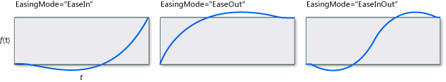

<!-- Class syntax.
public class BackEase : Windows.UI.Xaml.Media.Animation.EasingFunctionBase, Windows.UI.Xaml.Media.Animation.IBackEase
-->

# Windows.UI.Xaml.Media.Animation.BackEase

## -description
Represents an easing function that changes a value in the opposite direction of the main function during part of a duration, then reverses and finishes the function-over-time behavior in a conventional way.


## -xaml-syntax
```xaml
<BackEase .../>
```


## -remarks
BackEase is one of the two easing functions that can produce a value outside of the normal **From**/**To** range. (The other is [ElasticEase](elasticease.md).)
+ If [EasingMode](easingmode.md) is **EaseIn** (the default) then the function starts by changing the value in the opposite direction of the value change that **From** and **To** indicate, in other words it initially produces a value that's less than the **From** value.
+ If [EasingMode](easingmode.md) is **EaseOut** then the function starts in a typical way, but near the end will exceed the **To** value and then come back to the **To** value at the end.
+ If [EasingMode](easingmode.md) is **EaseInOut** then the function gives values that are less than **From** at the beginning and greater than **To** near the end.
 This illustration shows a function-over-time graph approximation for a BackEase for each of the three possible [EasingMode](easingmode.md) values, with [Amplitude](backease_amplitude.md) as its default value.

You might get best results by just experimenting with the [Springiness](elasticease_springiness.md) and [EasingMode](easingfunctionbase_easingmode.md) properties until the animation is visually doing what you want for your animated property value scenario.

An easing function can be applied to the **EasingFunction** properties of **From**/**To**/**By** animations, or to the **EasingFunction** properties of key-frame types used for the **Easing** variants of key-frame animations. For more info, see [Key-frame animations and easing function animations](/windows/uwp/graphics/key-frame-and-easing-function-animations).

## -examples
The following example applies a BackEase easing function to a [DoubleAnimation](doubleanimation.md) to create an animation that retracts slightly at the beginning and end of the animation.


<!--  
      <p xml:space="preserve">
            <TRANSLATE_MANUALLY>
              <externalLink xmlns="http://ddue.schemas.microsoft.com/authoring/2003/5">
                <linkText>Run this sample</linkText>
                <linkUri>http://go.microsoft.com/fwlink/p/?linkid=139798&amp;sref=BackEase_scale</linkUri>
              </externalLink>
            </TRANSLATE_MANUALLY>
          </p>-->


[!code-xaml[BackEase_scale](../windows.ui.xaml.media.animation/code/BackEase_scale/csharp/Page.xaml#SnippetBackEase_scale)]


[!code-csharp[BackEase_scale_code](../windows.ui.xaml.media.animation/code/BackEase_scale/csharp/Page.xaml.cs#SnippetBackEase_scale_code)]

[!code-vb[BackEase_scale_code](../windows.ui.xaml.media.animation/code/BackEase_scale/vbnet/MainPage.xaml.vb#SnippetBackEase_scale_code)]

## -see-also
[Storyboarded animations](/windows/uwp/graphics/storyboarded-animations), [PowerEase](powerease.md), [BounceEase](bounceease.md), [CircleEase](circleease.md), [CubicEase](cubicease.md), [ElasticEase](elasticease.md), [ExponentialEase](exponentialease.md), [QuadraticEase](quadraticease.md), [QuarticEase](quarticease.md), [QuinticEase](quinticease.md), [SineEase](sineease.md), [QuinticEase](quinticease.md), [SineEase](sineease.md)
