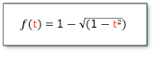

<!-- Class syntax.
public class CircleEase : Windows.UI.Xaml.Media.Animation.EasingFunctionBase, Windows.UI.Xaml.Media.Animation.ICircleEase
-->

# Windows.UI.Xaml.Media.Animation.CircleEase

## -description
Represents an easing function that creates an animation that accelerates and/or decelerates using a circular function.

## -xaml-syntax
```xaml
<CircleEase .../>
```


## -remarks
[CircleEase](circleease.md) is an easing function that has a function-over-time formula that resembles a cosine curve when represented as a function-time graph. When [EasingMode](easingfunctionbase_easingmode.md) is **EaseIn** (the default), this easing function starts slow and accelerates gradually as it reaches the end. It reaches about 15% value halfway through the duration.

An easing function can be applied to the **EasingFunction** properties of **From**/**To**/**By** animations, or to the **EasingFunction** properties of key-frame types used for the **Easing** variants of key-frame animations. For more info, see [Key-frame animations and easing function animations](http://msdn.microsoft.com/library/d8af24cd-f4c2-4562-afd7-25010955d677).

The formula used for this function is:



An easing function can be applied to the **EasingFunction** properties of **From**/**To**/**By** animations, or to the **EasingFunction** properties of key-frame types used for the **Easing** variants of key-frame animations. For more info, see [Key-frame animations and easing function animations](http://msdn.microsoft.com/library/d8af24cd-f4c2-4562-afd7-25010955d677).

## -examples
This XAML example applies a [CircleEase](circleease.md) easing function to a [DoubleAnimation](doubleanimation.md) to create a decelerating animation.


[!code-xml[CircleEase](../windows.ui.xaml.media.animation/code/CircleEase/csharp/Page.xaml#SnippetCircleEase)]

[!code-csharp[CircleEase_code](../windows.ui.xaml.media.animation/code/CircleEase/csharp/Page.xaml.cs#SnippetCircleEase_code)]

[!code-vb[CircleEase_code](../windows.ui.xaml.media.animation/code/CircleEase/vbnet/MainPage.xaml.vb#SnippetCircleEase_code)]

## -see-also
[Storyboarded animations](http://msdn.microsoft.com/library/0cbceea0-2b0e-44a1-a09a-f7a939632f3a), [Key-frame animations and easing function animations](http://msdn.microsoft.com/library/d8af24cd-f4c2-4562-afd7-25010955d677), [EasingFunctionBase](easingfunctionbase.md), [PowerEase](powerease.md), [BackEase](backease.md), [BounceEase](bounceease.md), [CubicEase](cubicease.md), [ElasticEase](elasticease.md), [ExponentialEase](exponentialease.md), [QuadraticEase](quadraticease.md), [QuarticEase](quarticease.md), [QuinticEase](quinticease.md), [SineEase](sineease.md)
rticease.md), [QuinticEase](quinticease.md), [SineEase](sineease.md)
