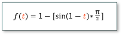

<!-- Class syntax.
public class SineEase : Windows.UI.Xaml.Media.Animation.EasingFunctionBase, Windows.UI.Xaml.Media.Animation.ISineEase
-->

# Windows.UI.Xaml.Media.Animation.SineEase

## -description
Represents an easing function that creates an animation that accelerates and/or decelerates using a sine formula.


## -xaml-syntax
```xaml
<SineEase .../>
```


## -remarks
SineEase is an easing function that has a function-over-time formula that resembles a sine curve when represented as a function-time graph. When [EasingMode](easingfunctionbase_easingmode.md) is **EaseIn** (the default), this easing function starts slow and accelerates gradually as it reaches the end. It reaches about 30% value halfway through the duration.

The formula used for this function is:



An easing function can be applied to the **EasingFunction** properties of **From**/**To**/**By** animations, or to the **EasingFunction** properties of key-frame types used for the **Easing** variants of key-frame animations. For more info, see [Key-frame animations and easing function animations](/windows/uwp/graphics/key-frame-and-easing-function-animations).

## -examples
This XAML example applies a SineEase easing function to a [DoubleAnimation](doubleanimation.md) to create a decelerating animation.


[!code-xaml[SineEase](../windows.ui.xaml.media.animation/code/SineEase/csharp/Page.xaml#SnippetSineEase)]

[!code-csharp[SineEase_code](../windows.ui.xaml.media.animation/code/SineEase/csharp/Page.xaml.cs#SnippetSineEase_code)]

[!code-vb[SineEase_code](../windows.ui.xaml.media.animation/code/SineEase/vbnet/MainPage.xaml.vb#SnippetSineEase_code)]

## -see-also
[Key-frame animations and easing function animations](/windows/uwp/graphics/key-frame-and-easing-function-animations), [Storyboarded animations](/windows/uwp/graphics/storyboarded-animations), [PowerEase](powerease.md), [BackEase](backease.md), [BounceEase](bounceease.md), [CircleEase](circleease.md), [CubicEase](cubicease.md), [ElasticEase](elasticease.md), [ExponentialEase](exponentialease.md), [QuadraticEase](quadraticease.md), [QuarticEase](quarticease.md), [QuinticEase](quinticease.md), [QuarticEase](quarticease.md), [QuinticEase](quinticease.md)
