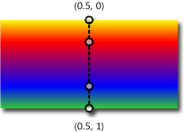

<!-- Class syntax.
public class LinearGradientBrush : Windows.UI.Xaml.Media.GradientBrush, Windows.UI.Xaml.Media.ILinearGradientBrush
-->

# Windows.UI.Xaml.Media.LinearGradientBrush

## -description
Paints an area with a linear gradient.


## -xaml-syntax
```xaml
<LinearGradientBrush ...>
  oneOrMoreGradientStops
</LinearGradientBrush
```


## -remarks
LinearGradientBrush is a type of [Brush](brush.md) that is used for many possible UI properties that use a [Brush](brush.md) to fill some or all of an object's visual area in app UI. Examples of some of the most commonly-used properties that use a [Brush](brush.md) value include: [Control.Background](../windows.ui.xaml.controls/control_background.md), [Control.Foreground](../windows.ui.xaml.controls/control_foreground.md), [Shape.Fill](../windows.ui.xaml.shapes/shape_fill.md), [Control.BorderBrush](../windows.ui.xaml.controls/control_borderbrush.md), [Panel.Background](../windows.ui.xaml.controls/panel_background.md), [TextBlock.Foreground](../windows.ui.xaml.controls/textblock_foreground.md). LinearGradientBrush is an alternative to the more commonly used [SolidColorBrush](solidcolorbrush.md) type.

The [StartPoint](lineargradientbrush_startpoint.md) and [EndPoint](lineargradientbrush_endpoint.md) properties of LinearGradientBrush describe two points in a relative coordinate space. This creates an orientation for the gradient, and typically this specifies a horizontal gradient, or a vertical gradient. A diagonal gradient can also be used. A LinearGradientBrush typically has two or more [GradientStop](gradientstop.md) values for the [GradientStops](gradientbrush_gradientstops.md) property (an ordered collection). Each [GradientStop](gradientstop.md) specifies a [Color](gradientstop_color.md) and an [Offset](gradientstop_offset.md). [Offset](gradientstop_offset.md) represents a position between 0 (the [StartPoint](lineargradientbrush_startpoint.md)) and 1 (the [EndPoint](lineargradientbrush_endpoint.md)) along the gradient, and the actual pixel length of the brush and its gradient are adjusted based on the UI where you apply your LinearGradientBrush as a value. For more info on how [Offset](gradientstop_offset.md) values are defined and how [Offset](gradientstop_offset.md), [StartPoint](lineargradientbrush_startpoint.md) and [EndPoint](lineargradientbrush_endpoint.md) are related, see [Use brushes](/windows/uwp/graphics/using-brushes). It's common to use

You can use the [Transparent](../windows.ui/colors_transparent.md) value for one of the [GradientStop](gradientstop.md) colors. Although this doesn't visually apply any changes to UI (it's transparent), that point is detectable for hit-testing purposes. For more info on hit testing, see "Hit testing" section of [Mouse interactions](/windows/uwp/input-and-devices/mouse-interactions).

The [GradientStop](gradientstop.md) values of a LinearGradientBrush can be animated as part of transitions or decorative animations. Use one of the dedicated animation types that can animate a [Color](../windows.ui/color.md) value. This usually involves having `.(GradientStop.Color)` be a part of a longer property path for a [Storyboard.TargetProperty](/uwp/api/windows.ui.xaml.media.animation.storyboard.targetproperty) value. For more info on property targeting and how to animate properties that use [Brush](brush.md) values, see [Storyboarded animations](/windows/uwp/graphics/storyboarded-animations).

### Brushes as XAML resources

Each of the [Brush](brush.md) types that can be declared in XAML ([SolidColorBrush](solidcolorbrush.md), LinearGradientBrush, [ImageBrush](imagebrush.md)) is intended to be defined as a resource, so that you can reuse that brush as a resource throughout your app. The XAML syntax shown for [Brush](brush.md) types is appropriate for defining the brush as a resource. When you declare a brush as a resource, you also need an [x:Key attribute](/windows/uwp/xaml-platform/x-key-attribute) that you'll later use to refer to that resource from other UI definitions. For more info on XAML resources and how to use [x:Key attribute](/windows/uwp/xaml-platform/x-key-attribute), see [ResourceDictionary and XAML resource references](/windows/apps/design/style/xaml-resource-dictionary).

The advantage of declaring brushes as resources is that it reduces the number of runtime objects that are needed to construct a UI: the brush is now shared as a common resource that's providing values for multiple parts of the object graph.

If you look at the existing control template definitions for Windows Runtime XAML controls, you'll see that the templates use brush resources extensively (although these are usually [SolidColorBrush](solidcolorbrush.md), not LinearGradientBrush). Many of these resources are system resources, and they use the [{ThemeResource} markup extension](/windows/uwp/xaml-platform/themeresource-markup-extension) for the resource reference rather than [{StaticResource} markup extension](/windows/uwp/xaml-platform/staticresource-markup-extension). For more info on how to use system resource brushes in your own control template XAML, see [XAML theme resources](/windows/apps/design/style/xaml-theme-resources).

## -examples
This example creates a linear gradient with four colors and uses it to paint a **Rectangle**.


[!code-xaml[Gradient3](../windows.ui.xaml.media/code/Gradients/csharp/Page2.xaml#SnippetGradient3)]



## -see-also
[GradientBrush](gradientbrush.md), [RadialGradientBrush](/uwp/api/microsoft.ui.xaml.media.radialgradientbrush), [SolidColorBrush](solidcolorbrush.md), [Use brushes](/windows/uwp/graphics/using-brushes), [ResourceDictionary and XAML resource references](/windows/apps/design/style/xaml-resource-dictionary)
