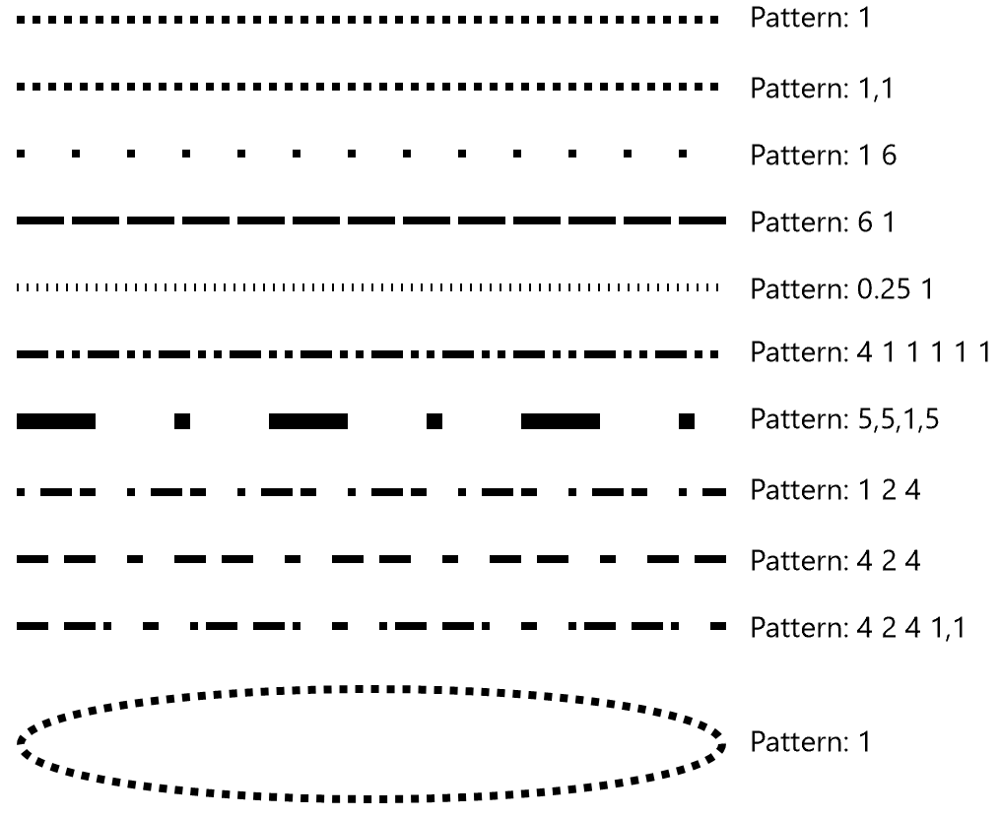

<!-- Property syntax
public Windows.UI.Xaml.Media.DoubleCollection StrokeDashArray { get;  set; }
-->

# Windows.UI.Xaml.Shapes.Shape.StrokeDashArray

## -description

Gets or sets a collection of [Double](/dotnet/api/system.double?view=dotnet-uwp-10.0&preserve-view=true) values that indicates the pattern of dashes and gaps that is used to outline shapes.


## -xaml-syntax

```xaml
<object StrokeDashArray="strokeDashString"/>
```


## -xaml-values

<dl><dt>strokeDashString</dt><dd>strokeDashStringA string of double values, that includes either a space or a comma as the delimiter between each double.</dd>
</dl>

## -property-value

A collection of [Double](/dotnet/api/system.double?view=dotnet-uwp-10.0&preserve-view=true) values that specifies the pattern of dashes and gaps.

## -remarks

A valid _strokeDashString_ for the StrokeDashArray property describes a repeating pattern of strokes and gaps. Each Double in the collection specifies the length of a dash or gap relative to the Thickness of the pen. For example, a value of 1 creates a dash or gap that has the same length as the thickness of the pen (a square). You can use a space, a comma, or a mixture of both as the separator.

Because the pattern repeats, `StrokeDashArray="1"` has the same result as `StrokeDashArray="1 1"`. If the collection has an odd number of values, the pattern alternates between starting with a stroke and starting with a gap, as shown in the examples.

You should typically use integral numeric values. Non-integral values can cause subpixel rendering and may alter the apparent color of the stroke.


## -examples

These examples show the effects of different StrokeDashArray values applied to Lines and an Ellipse.

```xaml
<StackPanel>
    <StackPanel.Resources>
        <Style TargetType="Line">
            <Setter Property="X1" Value="0"/>
            <Setter Property="X2" Value="360"/>
            <Setter Property="Stroke" Value="Black"/>
            <Setter Property="StrokeThickness" Value="4"/>
            <Setter Property="Margin" Value="12"/>
        </Style>
    </StackPanel.Resources>
    <Line StrokeDashArray="1"/>
    <Line StrokeDashArray="1,1"/>
    <Line StrokeDashArray="1 6"/>
    <Line StrokeDashArray="6 1"/>
    <Line StrokeDashArray="0.25 1"/>
    <Line StrokeDashArray="4 1 1 1 1 1"/>
    <Line StrokeDashArray="5,5,1,5" StrokeThickness="8"/>
    <Line StrokeDashArray="1 2 4"/>
    <Line StrokeDashArray="4 2 4"/>
    <Line StrokeDashArray="4 2 4 1,1"/>

    <Ellipse Height="60" Width="360" Stroke="Black" StrokeThickness="4"
             StrokeDashArray="1" HorizontalAlignment="Left" Margin="12"/>
</StackPanel>
```



## -see-also
