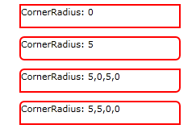

<!-- Structure syntax.
public struct CornerRadius
-->

# CornerRadius

## -description

Describes the characteristics of a rounded corner, such as can be applied to a [Border](../windows.ui.xaml.controls/border.md).


## -xaml-syntax

```xaml
<CornerRadius>uniformRadius</CornerRadius>
-or-
<CornerRadius>topLeft,topRight,bottomRight,bottomLeft</CornerRadius>
- or -
<object property="uniformRadius"/>
- or -
<object property="topLeft,topRight,bottomRight,bottomLeft"/>
```

## -xaml-values

<dl><dt>uniformRadius</dt><dd>uniformRadiusA value that specifies a uniform radius. The uniformRadius value is applied to all four CornerRadius values (BottomLeft, TopLeft, TopRight, BottomRight).</dd>
<dt>topLeft</dt><dd>topLeftSets the initial TopLeft.</dd>
<dt>topRight</dt><dd>topRightSets the initial TopRight.</dd>
<dt>bottomRight</dt><dd>bottomRightSets the initial BottomRight.</dd>
<dt>bottomLeft</dt><dd>bottomLeftSets the initial BottomLeft.</dd>
</dl>

## -struct-fields

### -field TopLeft

The radius of rounding, in pixels, of the upper-left corner of the object where a CornerRadius is applied.

### -field TopRight

The radius of rounding, in pixels, of the upper-right corner of the object where a CornerRadius is applied.

### -field BottomRight

The radius of rounding, in pixels, of the lower-right corner of the object where a CornerRadius is applied.

### -field BottomLeft

The radius of rounding, in pixels, of the lower-left corner of the object where a CornerRadius is applied.

## -remarks

### Notes on XAML syntax

Although you can specify a CornerRadius as an object element, you cannot specify the individual values such as **BottomLeft** as attributes of that object element. The XAML parser does not support setting XAML attribute values for this structure. For example, this XAML does not work:

```xaml
<!-- THIS DOES NOT WORK -->
<CornerRadius x:Key="CornerRadiusError" BottomLeft="20"/>
```

Instead, you must specify the values as initialization text within the CornerRadius. Using the object element syntax for a CornerRadius is useful if you want to declare a keyed resource that can be used by multiple [Border](../windows.ui.xaml.controls/border.md) instances for their [Border.CornerRadius](../windows.ui.xaml.controls/border_cornerradius.md). For more info on XAML initialization text, see [XAML syntax guide](/windows/uwp/xaml-platform/xaml-syntax-guide).

If you specify an attribute string or initialization text with two or three values, only the first value is respected and is treated as the *uniformRadius* (the other values are ignored). You must specify all four values to use a different behavior than *uniformRadius*.

You can use a space rather than a comma as the delimiter between values.

This example shows how to use initialization text to set the values of a CornerRadius resource, and then apply the resource to a Border.

```xaml
<Page.Resources>
    <CornerRadius x:Key="CornerRadius4010">40,10,40,10</CornerRadius>
</Page.Resources>

<Grid Background="{ThemeResource ApplicationPageBackgroundThemeBrush}">
    <Border BorderBrush="Blue" BorderThickness="2"
            CornerRadius="{StaticResource CornerRadius4010}"/>
</Grid>
```

### Projection and members of CornerRadius

If you are using a Microsoft .NET language (C# or Microsoft Visual Basic), or Visual C++ component extensions (C++/CX), then CornerRadius has non-data members available, and its data members are exposed as read-write properties, not fields. See [CornerRadius](/dotnet/api/windows.ui.xaml.cornerradius?view=dotnet-uwp-10.0&preserve-view=true) in the .NET API Browser.

If you are programming with [C++/WinRT](/windows/uwp/cpp-and-winrt-apis/index) or the [Windows Runtime C++ Template Library (WRL)](/cpp/windows/windows-runtime-cpp-template-library-wrl), then only the data member fields exist as members of CornerRadius, and you cannot use the utility methods or properties of the .NET projection. C++ code can access similar utility methods that exist on the [CornerRadiusHelper](cornerradiushelper.md) class.

This table shows the equivalent methods available in .NET and C++.

| .NET ([CornerRadius](/dotnet/api/windows.ui.xaml.cornerradius?view=dotnet-uwp-10.0&preserve-view=true)) | C++ ([CornerRadiusHelper](cornerradiushelper.md)) |
| ---- | --- |
| [CornerRadius(Double)](/dotnet/api/windows.ui.xaml.cornerradius.-ctor?view=dotnet-uwp-10.0&preserve-view=true#Windows_UI_Xaml_CornerRadius__ctor_System_Double_) | [FromUniformRadius(Double)](cornerradiushelper_fromuniformradius_2133321383.md) |
| [CornerRadius(Double, Double, Double, Double)](/dotnet/api/windows.ui.xaml.cornerradius.-ctor?view=dotnet-uwp-10.0&preserve-view=true#Windows_UI_Xaml_CornerRadius__ctor_System_Double_System_Double_System_Double_System_Double_) | [FromRadii(Double, Double, Double, Double)](cornerradiushelper_fromradii_1237964530.md) |

## -examples
This XAML example shows several styles of [Border](../windows.ui.xaml.controls/border.md) using different CornerRadius values:

```xaml
    <StackPanel>
        <Border Height="30" Width="200" CornerRadius="0"
         BorderThickness="2" BorderBrush="Red" Margin="5">
            <TextBlock>CornerRadius: 0</TextBlock>
        </Border>
        <Border Height="30" Width="200" CornerRadius="5"
         BorderThickness="2" BorderBrush="Red" Margin="5">
            <TextBlock>CornerRadius: 5</TextBlock>
        </Border>
        <Border Height="30" Width="200" CornerRadius="5,0,5,0"
         BorderThickness="2" BorderBrush="Red" Margin="5">
            <TextBlock>CornerRadius: 5,0,5,0</TextBlock>
        </Border>
        <Border Height="30" Width="200" CornerRadius="5,5,0,0"
         BorderThickness="2" BorderBrush="Red" Margin="5">
            <TextBlock>CornerRadius: 5,5,0,0</TextBlock>
        </Border>
    </StackPanel>
```

The XAML produces this rendered output:



## -see-also
