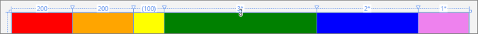

<!-- Structure syntax.
public struct GridLength 
-->

# GridLength

## -description

Represents a measurement for control logic that explicitly supports **Star** (\*) sizing and **Auto** sizing.


## -xaml-syntax

```xaml
<object property="doubleValue"/>
- or -
<object property="starSizing"/>
-or-
<object property="Auto"/>
```

## -xaml-values

<dl><dt>doubleValue</dt><dd>doubleValueThe row's height or column's width, expressed as a floating-point value for a pixel count. Typically this is specified as an integer, although interpolation of noninteger values is supported by grid layout.</dd>
<dt>starSizing</dt><dd>starSizingA string that includes the * character. A star sizing sizes rows or columns to take the remaining available space in a Grid. The * character can be preceded by a numeric factor that distributes available space in relation to any other star sizings, in other peer row or column definitions. For example, if Column A has star sizing of * and Column B has star sizing of 2*, then Column A receives one-third the available space and Column B receives two-thirds.</dd>
<dt>Auto</dt><dd>AutoThe column's width or the row's height, described by the literal string token Auto. Auto sizing distributes space based on the size of the content that is within a column or row.</dd>
</dl>

## -struct-fields

### -field Value

The measure for this GridLength, which is not necessarily a pixel measure.

### -field GridUnitType

A value of the [GridUnitType](gridunittype.md) enumeration that qualifies how **Value** is interpreted as a measure.

## -remarks

Types such as [ColumnDefinition](../windows.ui.xaml.controls/columndefinition.md) and [RowDefinition](../windows.ui.xaml.controls/rowdefinition.md) use GridLength values for some of their properties ([ColumnDefinition.Width](../windows.ui.xaml.controls/columndefinition_width.md) and [RowDefinition.Height](../windows.ui.xaml.controls/rowdefinition_height.md)). These property values are used to support variable distribution of available space in layout containers such as [Grid](../windows.ui.xaml.controls/grid.md) (and also derived types of [Grid](../windows.ui.xaml.controls/grid.md) such as [VariableSizedWrapGrid](../windows.ui.xaml.controls/variablesizedwrapgrid.md)).

A GridLength can describe one of three modes for sizing:

- A fixed width.
- A weighted distribution (star sizing).
- An "Auto" sizing mode.

GridLength values are typically declared in XAML attribute syntax. In XAML, the weighted distribution is declared using a "\*" symbol, preceded by a number that declares the weighting factor to use for that GridLength. The weighted distribution option is also known as *star sizing*.

The data values held by a GridLength ([Value](/uwp/api/windows.ui.xaml.gridlength.value) and [GridUnitType](/uwp/api/windows.ui.xaml.gridlength.gridunittype)) are both read-only. If you want to change the value of a property that takes a GridLength at run time, you have to create a new value using one of the constructors and replace the previous value.

### Star sizing

Star sizing is a convention whereby a GridLength has a number value that specifies a weighted factor versus other GridLength values. Any GridLength values that use star sizing divide the available space, accounting for the weighting factors, and evaluating after any fixed widths are applied. If none of the star sizings have weighting factors, the height or width is divided equally amongst them. The default weighting factor is 1.

This table provides some examples of star sizing results. For these examples, assume that the parent [Grid](../windows.ui.xaml.controls/grid.md) has a fixed width of 600, and that there are three columns.

| Column 0 | Column 1 | Column 2 | Result |
| -------- | -------- | -------- | ------ |
| 100 | 100 | * | 100,100,400 |
| 100 | * | * | 100,250,250 |
| 100 | * | 4* | 100,100,400 |

In code, a star sizing is equivalent to a GridLength where [IsStar](/dotnet/api/windows.ui.xaml.gridlength.isstar?view=dotnet-uwp-10.0&preserve-view=true) is **true**, [GridUnitType](/uwp/api/windows.ui.xaml.gridlength.gridunittype) is [Star](gridunittype.md), and [Value](/uwp/api/windows.ui.xaml.gridlength.value) is the weighted factor applied.

Non-integer weighting factors are permitted; for example, ".5*".

### Auto sizing

Auto sizing distributes space evenly based on the size of the content that is within a column or row. The exact logic for auto sizing is implemented by the control or class using the GridLength values. Typically that class is [Grid](../windows.ui.xaml.controls/grid.md), as it interprets its [RowDefinition](../windows.ui.xaml.controls/rowdefinition.md) and [ColumnDefinition](../windows.ui.xaml.controls/columndefinition.md) components.

### Notes on XAML syntax

Although you can specify a GridLength as an object element, you cannot specify the individual values, such as **Value**, as attributes of that object element. The XAML parser does not support setting XAML attribute values for this structure. Instead, you must specify the values as initialization text within the GridLength. For more info on XAML initialization text, see [XAML syntax guide](/windows/uwp/xaml-platform/xaml-syntax-guide).

### Projection and members of GridLength

If you are using a Microsoft .NET language (C# or Microsoft Visual Basic), or Visual C++ component extensions (C++/CX), then GridLength has non-data members available, and its data members are exposed as read-only properties, not fields. See [GridLength](/dotnet/api/windows.ui.xaml.gridlength?view=dotnet-uwp-10.0&preserve-view=true) in the .NET API Browser.

If you are programming with [C++/WinRT](/windows/uwp/cpp-and-winrt-apis/index) or the [Windows Runtime C++ Template Library (WRL)](/cpp/windows/windows-runtime-cpp-template-library-wrl), then only the data member fields exist as members of GridLength, and you cannot use the utility methods or properties of the .NET projection. C++ code can access similar utility methods that exist on the [GridLengthHelper](gridlengthhelper.md) class.

This table shows the equivalent properties and methods available in .NET and C++.

| .NET ([GridLength](/dotnet/api/windows.ui.xaml.gridlength?view=dotnet-uwp-10.0&preserve-view=true)) | C++ ([GridLengthHelper](gridlengthhelper.md)) |
| ---- | --- |
| [GridLength(Double)](/dotnet/api/windows.ui.xaml.gridlength.-ctor?view=dotnet-uwp-10.0&preserve-view=true#Windows_UI_Xaml_GridLength__ctor_System_Double_) | [FromPixels(Double)](gridlengthhelper_frompixels_1866456731.md) |
| [GridLength(Double, GridUnitType)](/dotnet/api/windows.ui.xaml.gridlength.-ctor?view=dotnet-uwp-10.0&preserve-view=true#Windows_UI_Xaml_GridLength__ctor_System_Double_Windows_UI_Xaml_GridUnitType_) | [FromValueAndType(Double, GridUnitType)](gridlengthhelper_fromvalueandtype_1327023031.md) |
| [Auto](/dotnet/api/windows.ui.xaml.gridlength.auto?view=dotnet-uwp-10.0&preserve-view=true) | [Auto](gridlengthhelper_auto.md) |
| [Equals](/dotnet/api/windows.ui.xaml.gridlength.equals?view=dotnet-uwp-10.0&preserve-view=true) | [Equals(GridLength, GridLength)](gridlengthhelper_equals_1137730706.md) |
| [IsAbsolute](/dotnet/api/windows.ui.xaml.gridlength.isabsolute?view=dotnet-uwp-10.0&preserve-view=true) | [GetIsAbsolute(GridLength)](gridlengthhelper_getisabsolute_1317053469.md) |
| [IsAuto](/dotnet/api/windows.ui.xaml.gridlength.isauto?view=dotnet-uwp-10.0&preserve-view=true) | [GetIsAuto(GridLength)](gridlengthhelper_getisauto_1693944727.md) |
| [IsStar](/dotnet/api/windows.ui.xaml.gridlength.isstar?view=dotnet-uwp-10.0&preserve-view=true) | [GetIsStar(GridLength)](gridlengthhelper_getisstar_1349706545.md) |

## -examples

This example shows how to set grid column widths in XAML, either as a resource or directly as a Width property value.

```xaml
<Grid>
    <Grid.Resources>
        <GridLength x:Key="gridLength200">200</GridLength>
        <GridLength x:Key="gridLength2star">2*</GridLength>
    </Grid.Resources>
    <Grid.ColumnDefinitions>
        <ColumnDefinition x:Name="gridColumn0" Width="{StaticResource gridLength200}"/>
        <ColumnDefinition x:Name="gridColumn1" Width="200"/>
        <ColumnDefinition x:Name="gridColumn2" Width="Auto"/>
        <ColumnDefinition x:Name="gridColumn3" Width="3*"/>
        <ColumnDefinition x:Name="gridColumn4" Width="{StaticResource gridLength2star}"/>
        <ColumnDefinition x:Name="gridColumn5" Width="*"/>
    </Grid.ColumnDefinitions>
    <Border Background="Red" Grid.Column="0"/>
    <Border Background="Orange" Grid.Column="1"/>
    <Border Background="Yellow" Grid.Column="2" Width="100"/>
    <Border Background="Green" Grid.Column="3"/>
    <Border Background="Blue" Grid.Column="4"/>
    <Border Background="Violet" Grid.Column="5"/>
</Grid>
```

The XAML produces this output in the Visual Studio designer:



Here's how to set the same values in code. The first two grid lengths are equivalent, but the first one uses the simplified constructor.

```csharp
gridColumn0.Width = new GridLength(200);
gridColumn1.Width = new GridLength(200, GridUnitType.Pixel);
gridColumn2.Width = new GridLength(0, GridUnitType.Auto);
gridColumn3.Width = new GridLength(3, GridUnitType.Star);
gridColumn4.Width = new GridLength(2, GridUnitType.Star);
gridColumn5.Width = new GridLength(1, GridUnitType.Star);
```


## -see-also
[Grid](../windows.ui.xaml.controls/grid.md), [ColumnDefinition](../windows.ui.xaml.controls/columndefinition.md), [RowDefinition](../windows.ui.xaml.controls/rowdefinition.md), [ColumnDefinition.Width](../windows.ui.xaml.controls/columndefinition_width.md), [RowDefinition.Height](../windows.ui.xaml.controls/rowdefinition_height.md), [GridUnitType](gridunittype.md), [Layouts with XAML](/windows/uwp/design/layout/layouts-with-xaml)
