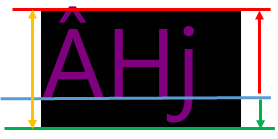
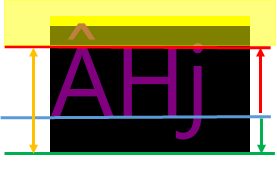
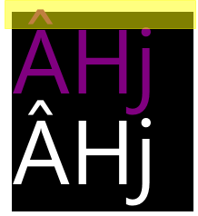
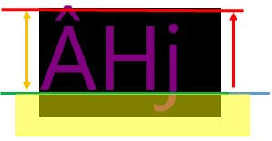
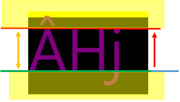

<!-- Enumeration syntax
public enum Windows.UI.Xaml.TextLineBounds : int
-->

# TextLineBounds

## -description
Influences how a line box height is calculated

## -enum-fields
### -field Full:0
Uses normal line box height calculation, this is the default.

### -field TrimToCapHeight:1
Top of line box height is the cap height from the font.

### -field TrimToBaseline:2
Bottom of line box height is the text baseline.

### -field Tight:3
Top of line box height is the cap height from the font, bottom of line box height is the text baseline.

## -remarks
How the TextLineBounds values influence line height calculations for adjacent lines is best shown through illustrations. The first illustration for each value shows a single line and the second shows two adjacent lines and their bounds.
+ Yellow areas represent the areas that are outside of a [TextBlock](../windows.ui.xaml.controls/textblock.md) outer boundary, and would thus be masked if there was adjacent content (text or otherwise).
+ The red line is the text cap height, which text ascenders might go above. The upper-case "Â" character in the illustrations has an ascender.
+ The green line is the text baseline, which text descenders might go below. The lower-case "j" character in the illustrations has a descender.

### Full

<table>
   <tr><td></td><td></td></tr>
</table>

### TrimToCapHeight

<table>
   <tr><td></td><td></td></tr>
</table>

### TrimToBaseline

<table>
   <tr><td></td><td></td></tr>
</table>

### Tight

<table>
   <tr><td></td><td></td></tr>
</table>

Note that for the **Tight** alignment there is a strong possibility that characters are overlapped if there are any ascenders or descenders. Especially if the different lines of characters use the same **Foreground** value, the overlap can negatively impact readability.

## -examples

## -see-also
