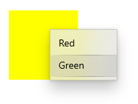

<!-- Event syntax
public event Windows.Foundation.TypedEventHandler ContextCanceled<Windows.UI.Xaml.UIElement,  Windows.UI.Xaml.RoutedEventArgs>
-->

# Windows.UI.Xaml.UIElement.ContextCanceled

## -description

Occurs when a context input gesture continues into a manipulation gesture, to notify the element that the context flyout should not be opened.


## -xaml-syntax

```xaml
<uiElement ContextCanceled="eventhandler"/>
```

## -remarks

We recommend the you set the [ContextFlyout](uielement_contextflyout.md) property to add a context menu to an element. When `ContextFlyout` is set, the context menu is shown and hidden automatically. You should only handle `ContextRequested` and `ContextCanceled` if you do not set `ContextFlyout`.

If you handle the [ContextRequested](uielement_contextrequested.md) event to show the context flyout, you should also handle this event to hide the flyout if the request is canceled.

You typically handle this event for elements that can be manipulated by drag-and-drop. This event is raised when a [ContextRequested](uielement_contextrequested.md) event has been raised, but the element has not received a [PointerReleased](uielement_pointerreleased.md) event before a manipulation begins. This indicates that the user intended to invoke a manipulation rather than a context flyout, so the context flyout should not be opened.

`ContextCanceled` is a routed event. For more info on the routed event concept, see [Events and routed events overview](/windows/uwp/xaml-platform/events-and-routed-events-overview).

## -examples

This example shows how to show and hide a context menu when the user right-clicks or performs an equivalent action. The context menu offers the options Red and Green and is placed on a rectangle.



```xaml
<Page
    ...>
    <Page.Resources>
        <MenuFlyout x:Key="colorMenuFlyout">
            <MenuFlyoutItem Text="Red" Tag="red" Click="MenuFlyoutItem_Click"/>
            <MenuFlyoutItem Text="Green" Tag="green" Click="MenuFlyoutItem_Click"/>
        </MenuFlyout>
    </Page.Resources>

    <Grid>
        <Rectangle Width="100" Height="100" Fill="Yellow"
                   ContextRequested="Color_ContextRequested" 
                   ContextCanceled="Color_ContextCanceled">
        </Rectangle>
    </Grid>
</Page>
```

```csharp
public sealed partial class MainPage : Page
{
    MenuFlyout colorMenuFlyout;

    public MainPage()
    {
        this.InitializeComponent();

        colorMenuFlyout = Resources["colorMenuFlyout"] as MenuFlyout;
    }

    private void Color_ContextRequested(UIElement sender, ContextRequestedEventArgs args)
    {
        Point point = new Point(0,0);

        if (args.TryGetPosition(sender, out point))
        {
            colorMenuFlyout.ShowAt(sender, point);
        }
        else
        {
            colorMenuFlyout.ShowAt((FrameworkElement)sender);
        }
    }

    private void Color_ContextCanceled(UIElement sender, RoutedEventArgs args)
    {
        colorMenuFlyout.Hide();
    }

    private void MenuFlyoutItem_Click(object sender, RoutedEventArgs e)
    {
        var item = sender as MenuFlyoutItem;
        var target = colorMenuFlyout.Target;
        if (string.Equals(item.Tag.ToString(), "red"))
        {
            ((Rectangle)target).Fill = new SolidColorBrush(Windows.UI.Colors.Red);
        }
        else if (string.Equals(item.Tag.ToString(), "green"))
        {
            ((Rectangle)target).Fill = new SolidColorBrush(Windows.UI.Colors.Green);
        }
    }
}
```

## -see-also

[ContextFlyout](uielement_contextflyout.md), [ContextRequested](uielement_contextrequested.md), [RoutedEventArgs](routedeventargs.md)
